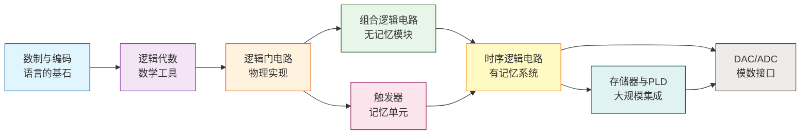

# 数字电路与逻辑设计

## 目录与引言

### 章节目录

| 章节 | 主题 | 核心内容 |
|:----:|:-----|:---------|
| 1 | **数制与编码** | 数制转换、原码/反码/补码、BCD码、格雷码、ASCII码 |
| 2 | **逻辑代数基础** | 基本运算、公式定律、卡诺图化简、标准形式 |
| 3 | **逻辑门电路** | TTL、CMOS、OC门、三态门、传输门、电气特性 |
| 4 | **组合逻辑电路** | 分析与设计、编码器/译码器/MUX/加法器、竞争-冒险 |
| 5 | **触发器** | RS/D/JK/T触发器、特性方程、激励表、相互转换 |
| 6 | **时序逻辑电路** | 分析/设计、计数器、寄存器、移位寄存器、序列检测器 |
| 7 | **半导体存储器与可编程逻辑器件** | ROM、RAM、CPLD、FPGA、LUT |
| 8 | **数模与模数转换** | DAC、ADC、分辨率、转换速度、采样定理 |

---

### 引言：何为数字电路？解决什么问题？为什么要学？

**何为数字电路？**

数字电路是处理**离散信号**（通常为二进制0和1）的电子电路。与之相对的是模拟电路（处理连续变化的电压/电流）。数字电路的核心构件是逻辑门（与、或、非）和存储单元（触发器），它们构成从简单的加法器到复杂的CPU等各种数字系统。

**解决什么问题？**

数字电路回答以下类型的问题：

- 如何用0和1表示数值和信息？（数制与编码）
- 如何用数学方法分析和设计逻辑功能？（逻辑代数）
- 如何用晶体管实现逻辑运算？（门电路）
- 如何构建无记忆的运算模块？（组合逻辑）
- 如何引入"记忆"来记录历史状态？（触发器）
- 如何设计随时间演变的电路？（时序逻辑）
- 如何大规模集成实现复杂功能？（存储器/PLD）
- 数字世界如何与模拟世界交互？（DAC/ADC）

**知识演进图谱：**

**为什么要学？**

1. **计算机硬件基础**：CPU、内存、总线等所有计算机硬件都是数字电路的具体实现。理解数字电路是理解计算机体系结构的前提。
2. **培养数字思维**：从连续到离散、从模拟到数字的思维转换，是信息时代最重要的思维方式之一。
3. **嵌入式与物联网核心**：FPGA、CPLD等可编程逻辑器件在现代通信、工业控制、AI加速中广泛应用。
4. **考研/期末核心科目**：多数高校电子信息类、计算机类专业的必修课，考研专业课（如北邮、成电等）的重点科目。
5. **从理论到实践的桥梁**：从数学（逻辑代数）到物理（晶体管电路）再到工程（系统设计）的完整链路。

---

### 学习建议

| 阶段 | 重点 | 方法 |
|:----:|:-----|:-----|
| 基础 | 数制转换、逻辑代数定律 | 反复做计算题，熟记公式 |
| 核心 | 卡诺图化简、组合电路设计、触发器特性 | 多画图、多列表 |
| 进阶 | 时序电路分析/设计、计数器设计 | 掌握状态图/状态表方法 |
| 应用 | 存储器扩展、DAC/ADC指标计算 | 联系实际芯片手册理解 |

> **建议**：数电是一门"动手"的学科——不要只读书，要**画电路图、列真值表、写状态方程**。每学完一个知识点，找3-5道例题做一遍，才能真正掌握。
