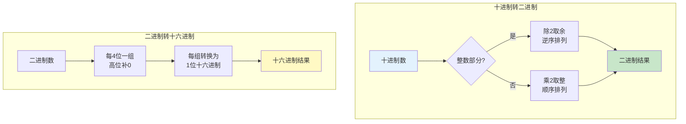

## 第一章：数制与编码

### 1.1 数制转换

#### ① 核心概念

**一句话总结：**
> 数制是计数的规则，不同数制只是同一数值的不同"书写方式"；数字电路天然使用二进制（0和1），而十六进制是二进制的"缩写"。

**生活类比：**
- **十进制** = 我们日常用的计数方式（满十进一），因为人有十根手指
- **二进制** = 数字电路的语言（满二进一），因为电路只有两个状态：高电平/低电平
- **十六进制** = 二进制的"速记法"，每4位二进制写成1位十六进制，方便工程师阅读

**前置知识关联：**
在学习数制转换之前，你需要理解"位权"的概念——每一位数字在不同位置上代表不同的数值。例如十进制数 352 = 3×10² + 5×10¹ + 2×10⁰，其中10²、10¹、10⁰就是位权。



---

#### ② 为什么需要多种数制？

**解决什么痛点？**

- **二进制**：数字电路只能识别0和1，但直接书写二进制很冗长（如十进制255 = 二进制11111111）
- **十六进制**：每1位十六进制 = 4位二进制，书写缩短3/4（如 0xFF），且与二进制转换极快
- **八进制**：早期计算机中使用（DEC、PDP系列），现代较少使用

**核心作用：**
1. **二进制**：数字电路的物理基础
2. **十六进制**：人类可读的二进制"缩写"，在编程、调试中广泛使用（内存地址、颜色值等）
3. **十进制**：符合人类习惯，用于人机交互

---

#### ③ 方法详解与示例

**方法一：R进制 → 十进制（按权展开法）**

通用公式：
\[
(a_n a_{n-1} \cdots a_1 a_0 . a_{-1} a_{-2} \cdots a_{-m})_R = \sum_{i=-m}^{n} a_i \times R^i
\]

**例题1**：将二进制 \( 1011.101 \) 转换为十进制。

**分析**：
- 整数部分：\( 1\times2^3 + 0\times2^2 + 1\times2^1 + 1\times2^0 = 8 + 0 + 2 + 1 = 11 \)
- 小数部分：\( 1\times2^{-1} + 0\times2^{-2} + 1\times2^{-3} = 0.5 + 0 + 0.125 = 0.625 \)

**解**：
\[
(1011.101)_2 = 11.625
\]

**例题2**：将十六进制 \( 2F.A \) 转换为十进制。

**解**：
\[
(2F.A)_{16} = 2\times16^1 + 15\times16^0 + 10\times16^{-1} = 32 + 15 + 0.625 = 47.625
\]

---

**方法二：十进制 → R进制**

**整数部分：除R取余法**（逆序排列）

| 步骤 | 操作 | 商 | 余数 |
|:----:|:----:|:--:|:----:|
| 1 | 123 ÷ 2 | 61 | 1 (LSB) |
| 2 | 61 ÷ 2 | 30 | 1 |
| 3 | 30 ÷ 2 | 15 | 0 |
| 4 | 15 ÷ 2 | 7 | 1 |
| 5 | 7 ÷ 2 | 3 | 1 |
| 6 | 3 ÷ 2 | 1 | 1 |
| 7 | 1 ÷ 2 | 0 | 1 (MSB) |

结果（逆序读取余数）：\( (123)_{10} = (1111011)_2 \)

**小数部分：乘R取整法**（顺序排列）

| 步骤 | 操作 | 积的整数部分 | 剩余小数 |
|:----:|:----:|:-----------:|:--------:|
| 1 | 0.6875 × 2 | 1 (MSD) | 0.3750 |
| 2 | 0.3750 × 2 | 0 | 0.7500 |
| 3 | 0.7500 × 2 | 1 | 0.5000 |
| 4 | 0.5000 × 2 | 1 (LSD) | 0.0000 |

结果（顺序读取整数部分）：\( (0.6875)_{10} = (0.1011)_2 \)

**例题3**：将十进制 47.25 转换为十六进制。

**解**：
整数部分 47：
\[
47 \div 16 = 2 \cdots 15 \;(F)
\]
\[
2 \div 16 = 0 \cdots 2
\]
逆序：\( (47)_{10} = (2F)_{16} \)

小数部分 0.25：
\[
0.25 \times 16 = 4.00 \Rightarrow 4
\]
顺序：\( (0.25)_{10} = (0.4)_{16} \)

结果：\( (47.25)_{10} = (2F.4)_{16} \)

---

**方法三：二进制 ⇄ 十六进制（4位一组法）**

```mermaid
flowchart LR
    subgraph 二进制转十六进制
        A[1011101011.1101] --> B[0010 1110 1011 . 1101]
        B --> C[2 E B . D]
        C --> D[(2EB.D)₁₆]
    end
    subgraph 十六进制转二进制
        E[(A3F.C)₁₆] --> F[A 3 F . C]
        F --> G[1010 0011 1111 . 1100]
        G --> H[101000111111.11]
    end
```

**例题4**：将二进制 \( 11010110.1011 \) 转换为十六进制。

**解**：
\[
1101\;0110\;.\;1011
\]
\[
D\quad\;6\quad\;.\quad B
\]
结果：\( (D6.B)_{16} \)

---

#### ④ 易错点与避坑指南

| 易错点 | 错误示例 | 正确做法 |
|:-------|:---------|:---------|
| 二进制小数不能精确转换 | \( (0.1)_{10} = (0.0001100\cdots)_2 \) | 无限循环，根据精度截断 |
| 十六进制中字母混淆 | 将B(11)误认为8 | 熟记 A=10, B=11, C=12, D=13, E=14, F=15 |
| 小数转换顺序搞反 | 乘2取整写成了逆序 | 整数除R取余逆序，小数乘R取整顺序 |
| 补0位置错误 | 二进制转十六进制左补0而非右补0 | 整数部分左补0，小数部分右补0 |

---

#### ⑤ 练习题

**基础题：**

1. 将 \( (101101)_2 \) 转换为十进制。
2. 将 \( (89)_{10} \) 转换为二进制。
3. 将 \( (3F.8)_{16} \) 转换为十进制和二进制。
4. 将 \( (1101011.011)_2 \) 转换为十六进制。

**进阶题：**

5. 判断 \( (0.1)_{10} \) 能否用二进制精确表示。若不能，精确到小数点后6位的近似值是多少？
6. 设计一个思路：如何判断一个十进制小数能否被二进制精确表示？（提示：思考分母的质因数）

**解答提示：**
> 题1：45；题2：1011001；题3：63.5, 111111.1；题4：6B.6

---

### 1.2 原码、反码、补码

#### ① 核心概念

**一句话总结：**
> 补码是计算机表示带符号整数的标准方式，它将减法转化为加法，统一了符号位和数值位的处理。

**生活类比：**
- **原码** = 直接写正负号 + 绝对值，如 "+5" 或 "-5"
- **反码** = 负数的"对称镜像"
- **补码** = 时钟上的"倒拨改为正拨"——钟表上-4小时 ≡ +8小时（模12）

```mermaid
flowchart TD
    subgraph 补码的模运算本质
        A[字长n位] --> B[模 = 2ⁿ]
        B --> C[负数X的补码 = 2ⁿ + X]
        C --> D[例: -3的4位补码 = 16-3 = 13<br/>即1101]
    end
    subgraph 加法统一减法
        E[X - Y] --> F[X + (-Y)]
        F --> G[用补码: X补 + (-Y)补]
        G --> H[丢掉进位即得正确结果]
    end
    style D fill:#fce4ec
    style H fill:#c8e6c9
```

**核心公式：**

假设字长为 \( n \) 位（含1位符号位）：

| 编码 | 正数（含0） | 负数 |
|:----:|:-----------|:-----|
| 原码 | \( 0x_{n-2}\cdots x_0 \) | \( 1x_{n-2}\cdots x_0 \)（数值位不变） |
| 反码 | 同原码 | 符号位1，数值位按位取反 |
| 补码 | 同原码 | 反码 + 1 |

---

#### ② 为什么需要补码？

**解决什么痛点？**

用原码做减法时：
- 需要判断两数绝对值大小，决定谁减谁
- 符号位单独处理，电路复杂
- 存在"+0"和"-0"两种0的表示

```mermaid
flowchart LR
    subgraph 原码做减法
        A[计算 5 - 3] --> B[5原=0101, 3原=0011]
        B --> C{判断|5|>|3|?}
        C -->|是| D[0101 - 0011 = 0010]
        C -->|否, 如3-5| E[0011 - 0101 → 需借位]
        E --> F[结果负, 再处理符号]
    end
    subgraph 补码做减法
        G[计算 5 - 3] --> H[5补=0101, -3补=1101]
        H --> I[0101+1101=10010]
        I --> J[丢弃进位 → 0010 = +2 ✓]
    end
    style F fill:#ffcdd2
    style J fill:#c8e6c9
```

**补码的核心优势：**

1. **统一加减法**：\( A - B = A + (-B)_{\text{补}} \)，只需加法器
2. **唯一零表示**：4位补码中 0000 表示0，没有"负0"
3. **符号位自动参与运算**：不需要单独判断符号
4. **数值范围不对称**：\( -2^{n-1} \sim 2^{n-1}-1 \)，比原码多表示一个负数

---

#### ③ 方法详解与示例

**求补码的通用步骤：**

```
正数：补码 = 原码（符号位0 + 数值位）
负数：原码 → 符号位不变，数值位取反 → 再加1
```

**例题5**：求 -13 的8位补码表示。

**解**：
- 原码：\( 10001101 \)（符号位1，数值位13 = 0001101）
- 反码：\( 11110010 \)（数值位取反）
- 补码：\( 11110011 \)（反码+1）

验证：\( -128 + 64 + 32 + 16 + 0 + 0 + 2 + 1 = -128 + 115 = -13 \) ✓

**例题6**：已知补码 \( 11100110 \)（8位），求真值。

**解**：
方法一（直接法）：符号位为1，是负数。
- 补码减1得反码：\( 11100101 \)
- 反码取反得原码：\( 10011010 \)
- 真值：\( -(16+8+2) = -26 \)

方法二（快捷法）：从右向左找到第一个1（原数第1位），它左边所有位（除符号位）取反。
- 补码：\( 11100110 \)
- 从右数第一个1在第1位，右边不变，左边取反（符号位不变）→ \( 10011010 \)
- 真值 -26 ✓

---

**补码加法（最重要！）：**

**例题7**：用4位补码计算 \( 6 - 3 \)。

**解**：
\[
[6]_{\text{补}} = 0110,\quad [3]_{\text{补}} = 0011,\quad [-3]_{\text{补}} = 1101
\]
\[
0110 + 1101 = 10011 \quad (\text{丢弃第5位}) \Rightarrow 0011 = +3 \quad ✓
\]

**例题8**：用4位补码计算 \( -5 - 2 \)。

**解**：
\[
[-5]_{\text{补}} = 1011,\quad [-2]_{\text{补}} = 1110
\]
\[
1011 + 1110 = 11001 \quad (\text{丢弃第5位}) \Rightarrow 1001
\]
结果 1001 为负数，求其真值：\( 1001 \rightarrow 1110 \rightarrow 1111 = -7 \) ✓
（验证：-5 - 2 = -7，正确）

---

**溢出判断：**

当两个**同号**数相加结果**异号**时，发生溢出。

**例题9**：用4位补码计算 \( 5 + 4 \)。

**解**：
\[
[5]_{\text{补}} = 0101,\quad [4]_{\text{补}} = 0100
\]
\[
0101 + 0100 = 1001
\]
结果符号位为1（负），而5+4应为正数 — **溢出！**
原因：4位补码范围为 -8~7，9超出范围。

**溢出判断口诀：** 正+正=负 或 负+负=正 → 溢出

---

#### ④ 原码、反码、补码的数值范围

| 字长n | 原码/反码范围 | 补码范围 |
|:-----:|:-------------:|:---------:|
| 4 | -7 ~ +7 | -8 ~ +7 |
| 8 | -127 ~ +127 | -128 ~ +127 |
| 16 | -32767 ~ +32767 | -32768 ~ +32767 |
| n | -(2ⁿ⁻¹-1) ~ +(2ⁿ⁻¹-1) | -2ⁿ⁻¹ ~ +(2ⁿ⁻¹-1) |

补码多一个最小值（如 -128）的原因：\( -0 \) 的原码 \( 10000000 \) 在补码中表示 \( -128 \)。

---

#### ⑤ 练习题

**基础题：**

1. 求下列十进制数的8位补码：① 35  ② -35  ③ -128  ④ 0
2. 已知以下8位补码，求真值：① 01011010  ② 10101010  ③ 11111111
3. 用8位补码计算：① 67 - 25  ② -30 - 50

**进阶题：**

4. 用4位补码计算 3 + 6，验证是否溢出。如何判断溢出？
5. 证明：补码的补码等于原码。
6. 在8位补码系统中，-128的补码是什么？为什么它能存在？

**解答提示：**
> 题1：00100011, 11011101, 10000000, 00000000
> 题2：90, -86, -1
> 题3：0101010(=42), 10110000(= -80, 说明溢出判断位丢失，但计算结果截断后正确? 验证一下: -30补=11100010, -50补=11001110, 相加=110110000→丢弃最高位得10110000→-80✓)

---

### 1.3 常用二进制编码

#### ① 核心概念

**一句话总结：**
> 二进制编码是用0/1给不同对象"起名字"的规则——BCD码给十进制数字起名，格雷码给相邻值起名（只有1位不同），ASCII码给字符起名。

**三种编码对比：**


---

#### ② 为什么需要这些编码？

| 编码 | 解决什么痛点？ | 典型应用 |
|:----:|:--------------|:---------|
| BCD码 | 二进制显示为十进制时需频繁转换，BCD码直接每4位对应1位十进制数字 | 电子钟、计算器、数码管显示 |
| 格雷码 | 普通二进制多位数变化时，各bit传输延迟不同可能产生错误码 | 异步FIFO地址传递、轴编码器 |
| 余3码 | BCD码的"自补"特性，简化减法运算 | 早期计算机的十进制运算 |
| ASCII码 | 统一字符的计算机表示标准 | 文本通信、编程、键盘输入 |

---

#### ③ 方法详解与示例

**BCD码（8421码）**

每个十进制数字用4位二进制表示，权重分别为 8、4、2、1。

| 十进制 | 8421 BCD | 余3码(XS-3) |
|:------:|:--------:|:-----------:|
| 0 | 0000 | 0011 |
| 1 | 0001 | 0100 |
| 2 | 0010 | 0101 |
| 3 | 0011 | 0110 |
| 4 | 0100 | 0111 |
| 5 | 0101 | 1000 |
| 6 | 0110 | 1001 |
| 7 | 0111 | 1010 |
| 8 | 1000 | 1011 |
| 9 | 1001 | 1100 |

> 注意：BCD码中 1010~1111 是**无效编码**（非法码）

**例题10**：将十进制数 397 表示为BCD码和余3码。

**解**：
- BCD码：\( 3 \rightarrow 0011,\; 9 \rightarrow 1001,\; 7 \rightarrow 0111 \) → \( 0011\;1001\;0111 \)
- 余3码：\( 3 \rightarrow 0110,\; 9 \rightarrow 1100,\; 7 \rightarrow 1010 \) → \( 0110\;1100\;1010 \)

---

**格雷码（Gray Code）**

**二进制 → 格雷码（异或法）：**
\[
G_{n-1} = B_{n-1}
\]
\[
G_i = B_i \oplus B_{i+1} \quad (i = 0,1,\ldots,n-2)
\]

**格雷码 → 二进制（异或法）：**
\[
B_{n-1} = G_{n-1}
\]
\[
B_i = G_i \oplus B_{i+1} \quad (i = 0,1,\ldots,n-2)
\]

**3位格雷码序列（镜像法构造）：**

```
二进制:  000 001 010 011 100 101 110 111
格雷码:  000 001 011 010 110 111 101 100
                       ↑ 相邻仅变1位
```

**例题11**：将二进制 10110 转换为格雷码。

**解**：
\[
G_4 = B_4 = 1
\]
\[
G_3 = B_4 \oplus B_3 = 1 \oplus 0 = 1
\]
\[
G_2 = B_3 \oplus B_2 = 0 \oplus 1 = 1
\]
\[
G_1 = B_2 \oplus B_1 = 1 \oplus 1 = 0
\]
\[
G_0 = B_1 \oplus B_0 = 1 \oplus 0 = 1
\]
结果：\( 11101 \)

**例题12**：将格雷码 1101 转换为二进制。

**解**：
\[
B_3 = G_3 = 1
\]
\[
B_2 = G_2 \oplus B_3 = 1 \oplus 1 = 0
\]
\[
B_1 = G_1 \oplus B_2 = 0 \oplus 0 = 0
\]
\[
B_0 = G_0 \oplus B_1 = 1 \oplus 0 = 1
\]
结果：\( 1001 \)

---

#### ④ 常见编码的对比

| 特性 | 8421 BCD | 余3码 | 格雷码 | ASCII |
|:----|:---------|:------|:-------|:------|
| 位数 | 4 | 4 | 可变 | 7(或8) |
| 权重 | 8421 | 无权 | 无权 | 无权 |
| 自补性 | ❌ | ✅ | ❌ | ❌ |
| 相邻性 | ❌ | ❌ | ✅ | ❌ |
| 循环特性 | ❌ | ❌ | ✅（循环格雷码） | ❌ |
| 主要用途 | 十进制显示 | 早期二进制减法 | 异步传输、编码器 | 文本表示 |

---

#### ⑤ 练习题

**基础题：**

1. 将十进制 864 转换为BCD码。
2. 判断 BCD码 01111001 对应的十进制值是多少？
3. 将二进制 11001010 转换为格雷码。
4. 将格雷码 101011 转换为二进制。

**进阶题：**

5. 为什么格雷码相邻编码只有1位变化？这个特性在什么场景下特别重要？
6. 证明余3码是自补码：对余3码的每一位取反，得到的是该数字对9的补数的余3码。
7. 设计一个4位格雷码到二进制码的转换电路逻辑表达式。

**解答提示：**
> 题1：1000 0110 0100；题2：79；题3：10101111；题4：110010
