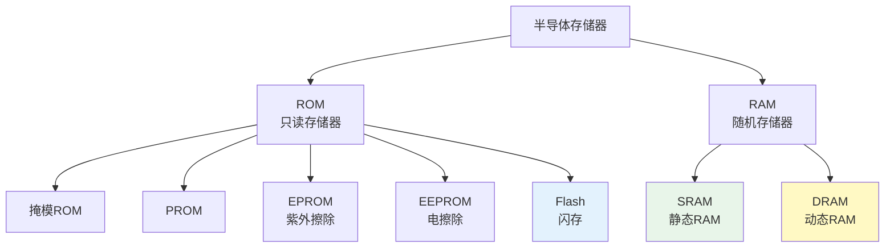
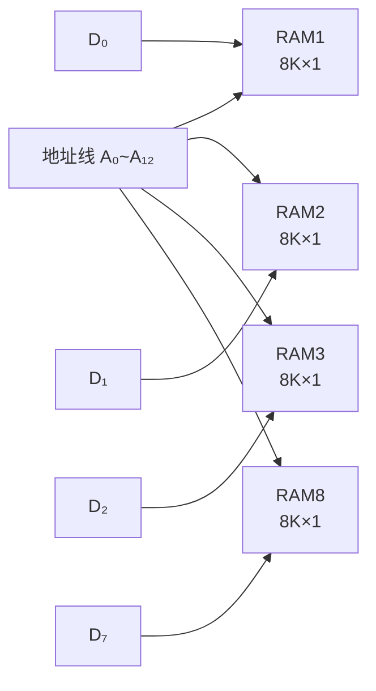
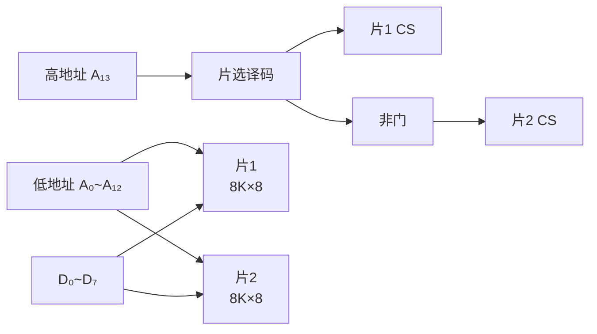
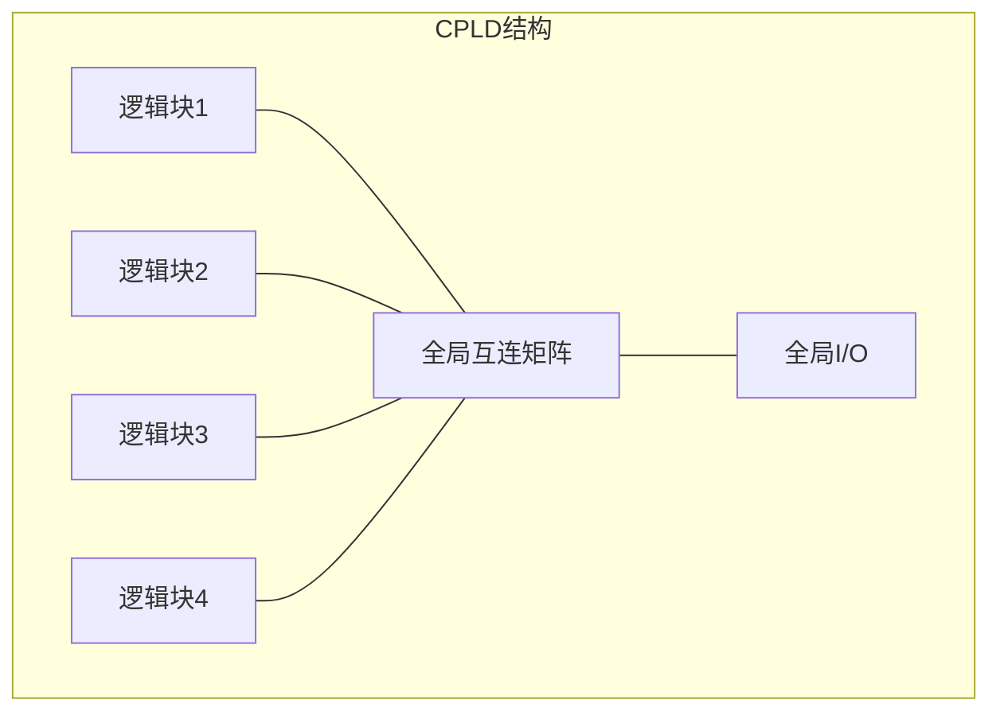
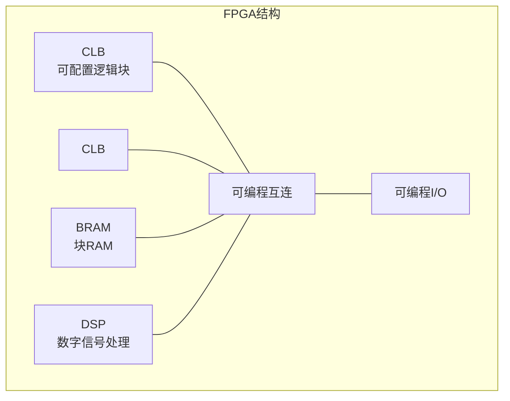

## 第七章：半导体存储器与可编程逻辑器件

### 7.1 半导体存储器概述

#### ① 核心概念

**一句话总结：**
> 半导体存储器是数字系统中用来**存储大量数据**的集成电路——ROM只读不写（掉电不丢），RAM可读可写（掉电丢失）。

**存储器的分类：**



#### ② ROM——只读存储器

**ROM的结构：**

```
          地址译码器（产生所有最小项）
地址 A₀ ──→                          
      A₁ ──→  存储矩阵（或阵列）──→ 输出缓冲器 ──→ D₀~D_{m-1}
      ...                           
      A_{n-1} ──→                  
```

**存储容量** = \( 2^n \)（字）× m（位），其中n为地址线数，m为数据线数。

**常见ROM类型对比：**

| 类型 | 编程方式 | 擦除方式 | 用途 |
|:----|:---------|:---------|:-----|
| 掩模ROM | 生产时编程 | 不可擦除 | 大规模量产 |
| PROM | 用户一次编程 | 不可擦除 | 小批量生产 |
| EPROM | 用户编程 | 紫外光擦除 | 开发调试 |
| EEPROM | 电编程 | 电擦除（字节级） | 参数存储 |
| Flash | 电编程 | 电擦除（块级） | U盘、SSD、固件 |

#### ③ RAM——随机存取存储器

**SRAM（静态RAM）：**
- 存储单元：6个晶体管组成锁存器
- 特点：速度快、功耗较大、集成度低（1位需要6个晶体管）
- 用途：Cache、寄存器文件

**DRAM（动态RAM）：**
- 存储单元：1个晶体管 + 1个电容
- 特点：速度较慢、功耗低、集成度高（1位只要1个晶体管）
- 需要**定期刷新**（电容电荷会泄漏，约64ms刷新一次）
- 用途：主存（内存条）

| 特性 | SRAM | DRAM |
|:----|:----|:-----|
| 存储单元 | 6个晶体管 | 1T+1C |
| 速度 | 快（~10ns） | 慢（~60ns） |
| 集成度 | 低 | 高 |
| 功耗 | 较高 | 较低 |
| 需刷新 | 否 | 是（~64ms） |
| 成本 | 高 | 低 |
| 用途 | Cache、寄存器 | 主存 |

#### ④ 存储容量的扩展

**位扩展（增加数据位宽）：**
- 例：用8片 8K×1位的RAM 构成 8K×8位的RAM
- 将地址线、读写控制线并联，数据线分别连接



**字扩展（增加存储深度）：**
- 例：用2片 8K×8位的RAM 构成 16K×8位的RAM
- 利用地址最高位进行片选



**例题1**：用 4片 8K×8位 的RAM构成 32K×8位的RAM，画出连线图。

**解**：
容量从8K扩展到32K，需要4倍字扩展。使用2线-4线译码器进行片选。
- 高2位地址（A₁₃, A₁₂）作为译码器输入
- 译码器4个输出分别接到4片RAM的片选端CS
- 低13位地址（A₀~A₁₂）和数据线（D₀~D₇）并联

| 地址范围 (A₁₅⋯A₀) | 片选 |
|:----------------:|:----:|
| 0000 0000 0000 0000 ~ 0001 1111 1111 1111 | 片0 |
| 0010 0000 0000 0000 ~ 0011 1111 1111 1111 | 片1 |
| 0100 0000 0000 0000 ~ 0101 1111 1111 1111 | 片2 |
| 0110 0000 0000 0000 ~ 0111 1111 1111 1111 | 片3 |

---

### 7.2 用ROM实现组合逻辑

#### ① 核心思想

**一句话总结：**
> ROM的地址译码器自动产生所有最小项，存储矩阵"记住"了哪些最小项需要"或"起来——任何组合逻辑函数都可以通过ROM的编程来实现。

**ROM实现组合逻辑的步骤：**
1. 将逻辑函数写成最小项之和的形式
2. 将输入变量接ROM的地址输入端
3. 将函数包含的最小项对应的存储单元编程为1
4. ROM的输出即为函数值

**ROM = 地址译码器（产生最小项）+ 或阵列（编程实现函数）**

**例题2**：用ROM实现 \( F_1(A,B,C) = \sum m(0,2,4,6) \)，\( F_2(A,B,C) = \sum m(1,3,5,7) \)

**解**：
容量：3位地址 → 8个字，至少需要2位数据输出。

地址-数据映射：

| 地址(A₂A₁A₀) | 数据(D₁D₀) |
|:------------:|:----------:|
| 000 | 10（F₁=1, F₂=0） |
| 001 | 01（F₁=0, F₂=1） |
| 010 | 10 |
| 011 | 01 |
| 100 | 10 |
| 101 | 01 |
| 110 | 10 |
| 111 | 01 |

观察：D₁ = A₀的取反（偶数地址为1），D₀ = A₀（奇数地址为1）
所以：F₁ = \( \overline{C} \)，F₂ = C

#### ② ROM的局限性

- 输入变量增加时，ROM容量指数增长：n个输入需要 \( 2^n \) 个存储字
- 对于n=20，需要1M个字 → 太大！
- 实际PLD使用**可编程逻辑阵列（PLA）** 来减少规模

---

### 7.3 可编程逻辑器件（PLD）

#### ① 核心概念

**一句话总结：**
> PLD是一种"硬件可编程"的芯片——通过编程（烧录）配置其内部逻辑功能，实现"软件定制的硬件"。

**PLD的发展历程：**


**PLD的基本结构：**
```
输入 → 输入缓冲 → 与阵列（产生乘积项）→ 或阵列（乘积项求和）→ 输出缓冲 → 输出
```

#### ② PAL与GAL

**PAL（可编程阵列逻辑）：**
- 与阵列可编程，或阵列固定
- 每个输出是固定数量乘积项的和（如每个输出最多8个乘积项）
- 一次编程，不可擦除

**GAL（通用阵列逻辑）：**
- 与PAL结构类似，但是**可重复编程**（EEPROM工艺）
- 输出逻辑宏单元（OLMC）可配置为组合输出、寄存器输出等
- 引脚功能可编程（灵活性更高）

#### ③ CPLD与FPGA

**CPLD（复杂可编程逻辑器件）：**



**特点：**
- 基于乘积项（PAL结构扩展）
- 非易失性（掉电不丢）
- 时序可预测（确定性的延迟）
- 适合中等规模逻辑、控制电路

**FPGA（现场可编程门阵列）：**



**特点：**
- 基于查找表（LUT）+ 触发器的结构
- 易失性（需要外部配置芯片）
- 逻辑密度极高（几万~几百万门）
- 适合复杂逻辑、高速数字信号处理
- 代表厂商：Xilinx（AMD）、Altera（Intel）

**LUT（查找表）原理：**

一个4输入LUT本质上是一个16×1的RAM：
- 4个输入作为地址 → 16个存储单元
- 存储单元中预置了真值表的输出值
- 任何4输入组合逻辑函数都可以用1个LUT实现

---

### 7.4 练习题

**基础题：**

1. ROM和RAM的主要区别是什么？各自用在什么场景？
2. SRAM和DRAM的区别是什么？为什么DRAM需要刷新？
3. 用两片 8K×4位 的RAM扩展为 8K×8位 的RAM，画出连线图。
4. 用一片 8×4位 的ROM实现一个全加器。

**进阶题：**

5. 用4片 16K×8位的RAM构成 64K×8位的RAM，列出地址分配表，画出片选译码电路。
6. 用ROM实现一个4位二进制数到7段数码管的译码器（输入0~9的BCD码，输出a~g段码）。
7. FPGA与CPLD的主要区别是什么？各自适用于什么场景？

**解答提示：**
> 题1：ROM掉电不丢数据（非易失），RAM掉电丢失（易失）。ROM存固件，RAM存运行数据。
> 题3：地址并联，控制并联，数据线各接4位
> 题4：输入(A,B,Cᵢ)3位地址→8个字，每个字2位(S,Cₒ)
