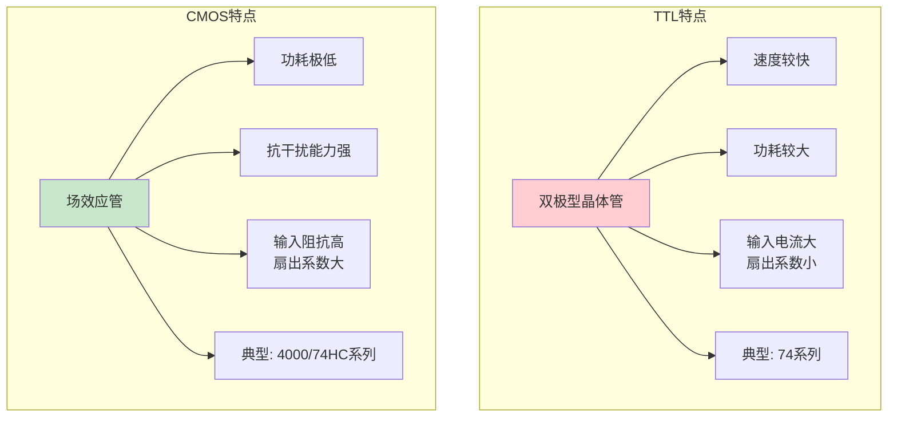
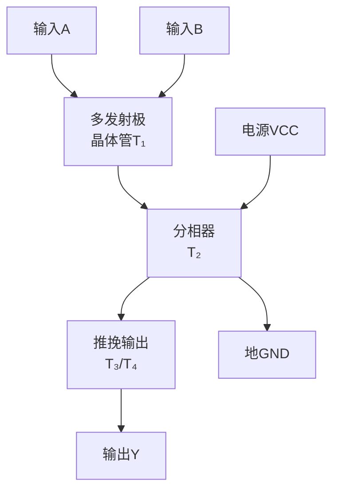
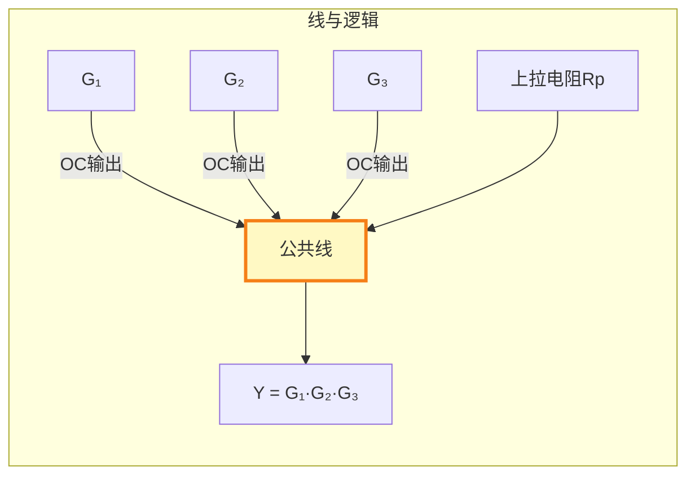
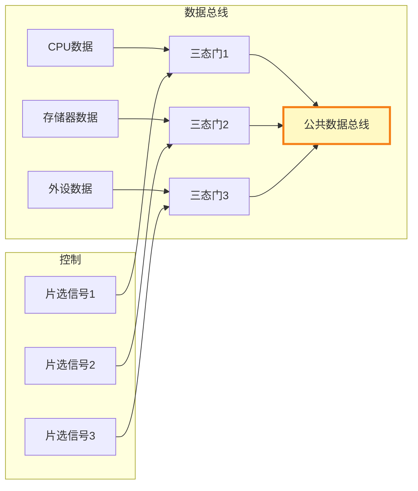
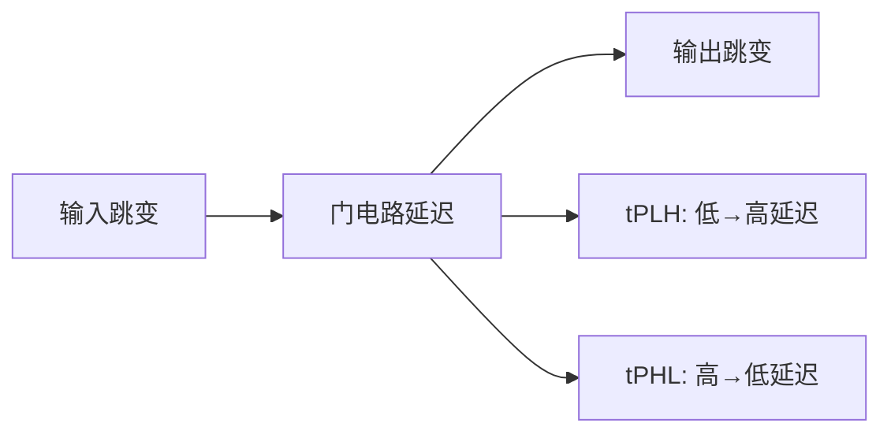

## 第三章：逻辑门电路

### 3.1 TTL与CMOS门电路

#### ① 核心概念

**一句话总结：**
> 逻辑门是数字电路最基本的"积木块"——与门、或门、非门等，它们由晶体管构成，分别实现逻辑代数中的基本运算。

**生活类比：**
- **TTL（晶体管-晶体管逻辑）**：像柴油发动机——功耗大、力气大（驱动能力强）、速度快，但费油
- **CMOS（互补金属氧化物半导体）**：像电动机——功耗极低（几乎不发热），多数时候"待机"不耗电，是目前的主流技术



#### ② 为什么需要了解门电路？

**解决什么痛点？**

1. **理论到实践的桥梁**：逻辑代数的与或非需要物理载体来实现
2. **电气特性影响设计**：不同门电路的电压电平、驱动能力、延迟时间不同，直接决定系统能否正常工作
3. **实际选型依据**：高速系统选TTL？低功耗系统选CMOS？需要了解两者差异
4. **接口电路设计**：TTL和CMOS之间互连时，需要电平匹配

#### ③ TTL与非门电路结构

**标准TTL与非门（74LS00）的内部结构（简化）：**



**TTL的电压电平标准（5V供电）：**

| 参数 | 符号 | 值 |
|:----|:----:|:--:|
| 输入低电平最大值 | \( V_{IL(max)} \) | 0.8V |
| 输入高电平最小值 | \( V_{IH(min)} \) | 2.0V |
| 输出低电平最大值 | \( V_{OL(max)} \) | 0.4V |
| 输出高电平最小值 | \( V_{OH(min)} \) | 2.4V |
| 噪声容限（低电平） | \( V_{NL} \) | \( V_{IL(max)} - V_{OL(max)} = 0.4V \) |
| 噪声容限（高电平） | \( V_{NH} \) | \( V_{OH(min)} - V_{IH(min)} = 0.4V \) |

#### ④ CMOS非门电路结构

**CMOS非门（反相器）由一对PMOS和NMOS组成：**

```
VDD
 |
PMOS (栅极接输入A)
 |
输出Y
 |
NMOS (栅极接输入A)
 |
GND
```

**工作状态：**
- **输入A=0（0V）**：NMOS截止，PMOS导通 → 输出Y=VDD（高电平）
- **输入A=1（VDD）**：NMOS导通，PMOS截止 → 输出Y=GND（低电平）

**CMOS的电压电平标准（5V供电）：**

| 参数 | 符号 | 值 |
|:----|:----:|:--:|
| 输入低电平最大值 | \( V_{IL(max)} \) | 1.5V |
| 输入高电平最小值 | \( V_{IH(min)} \) | 3.5V |
| 输出低电平最大值 | \( V_{OL(max)} \) | 0.05V |
| 输出高电平最小值 | \( V_{OH(min)} \) | 4.95V |
| 噪声容限 | \( V_N \) | 约1.45V（比TTL大得多） |

**CMOS的关键优势：** 静态功耗几乎为零（只有动态翻转时才耗电）！

#### ⑤ TTL vs CMOS对比

| 参数 | TTL(74LS) | CMOS(74HC) | 说明 |
|:----|:---------:|:----------:|:-----|
| 供电电压 | 5V±5% | 2~6V | CMOS更灵活 |
| 静态功耗 | ~2mW/门 | ~0.001mW/门 | CMOS极低 |
| 传输延迟 | ~10ns | ~8ns | 现代CMOS已超TTL |
| 扇出系数 | ~10 | ~50 | CMOS驱动更多门 |
| 噪声容限 | ~0.4V | ~1.45V | CMOS抗干扰更强 |
| 输入阻抗 | ~10kΩ | >100MΩ | CMOS几乎不消耗驱动电流 |

#### ⑥ 练习题

1. TTL与CMOS的噪声容限分别是多少？哪个抗干扰能力更强？
2. 为什么CMOS的扇出系数比TTL大得多？
3. 如何将TTL的输出连接到CMOS的输入？需要什么电平转换？

---

### 3.2 特殊门电路

#### ① OC门（集电极开路门）

**一句话总结：**
> OC门的输出端是"开路"的，需要外接上拉电阻才能工作——多个OC门的输出可以直接"线与"连接在一起。

**为什么需要OC门？**
- 普通TTL门输出不能直接并联（一个输出高、一个输出低会形成大电流烧毁）
- OC门允许输出并联，实现**线与**功能
- 可以驱动大电流负载（LED、继电器、总线）



**OC门的应用——总线传输：**

多个设备共享一条数据线，任何时刻只有一个设备"发言"（使能输出），其他设备输出高阻态。

#### ② 三态门（TSL门）

**一句话总结：**
> 三态门比普通门多一个"高阻态"——除了输出0和1，还能让输出呈现高阻抗（相当于断开），是实现总线共享的关键。

| 使能(EN) | 输入(A) | 输出(Y) |
|:--------:|:-------:|:--------:|
| 0 | × | 高阻(Z) |
| 1 | 0 | 0 |
| 1 | 1 | 1 |

**典型应用——单向总线：**



**三态门的使能控制：**
- **高有效使能**：EN=1时正常输出，EN=0时高阻
- **低有效使能**：EN=0时正常输出，EN=1时高阻（常用 \( \overline{EN} \) 表示）

#### ③ 传输门（TG）

**一句话总结：**
> 传输门像一个"电子开关"，由一对PMOS和NMOS并联构成，CMOS工艺下可以无损耗地传输0或1。

**结构与符号：**

```
输入  输出
  A ---|TG|--- Y
        ↑
        C (控制端)
```

**工作原理：**
- C=1, \( \overline{C} \) =0 → 传输门导通（A=Y）
- C=0, \( \overline{C} \) =1 → 传输门截止（高阻）

**应用：** 模拟开关、数据选择器、D锁存器

#### ④ 练习题

1. 为什么OC门的输出端需要上拉电阻？上拉电阻大小如何选择？
2. 三态门输出的三个可能状态是什么？为什么需要高阻态？
3. 画出两个OC门"线与"的电路图，写出逻辑表达式。
4. 三态门和OC门都可以实现输出并联，它们各自适用于什么场景？


### 3.3 门电路的电气特性

#### ① 传输延迟

信号通过门电路需要时间（不可能瞬时变化）：



**典型值：** TTL(74LS) ~10ns, CMOS(74HC) ~8ns, 高速CMOS(74LVC) ~3ns

**传输延迟的影响：**
- 限制系统最高工作频率
- 导致**竞争-冒险**（详见第四章）
- 引起**时序约束**问题（建立时间、保持时间）

#### ② 扇入与扇出

| 参数 | 定义 | 典型值 |
|:----|:-----|:------:|
| 扇入 | 一个门电路的**输入端数量** | 一般2~8 |
| 扇出 | 一个门电路能**驱动**的同类门数量 | TTL~10, CMOS~50 |

**扇出计算：**
\[
\text{扇出}_{高} = \frac{I_{OH}}{I_{IH}}, \quad
\text{扇出}_{低} = \frac{I_{OL}}{I_{IL}}
\]
取两者中的较小值。

#### ③ 功耗

- **静态功耗**：门电路没有翻转时消耗的功率
  - TTL：有静态功耗（约2mW/门）
  - CMOS：静态功耗极低（μW级）
- **动态功耗**：门电路翻转时消耗的功率
  - \( P = C_L V_{DD}^2 f \)（与频率、电压、负载电容成正比）

**CMOS功耗公式：**
\[
P_{total} = P_{static} + P_{dynamic} = I_{leak}V_{DD} + CLF_{CLK}V_{DD}^2
\]

---

#### ④ 练习题

1. 一个CMOS门电路的扇出系数为50，TTL门电路的扇出系数为10。门A的输出需要连接到30个门的输入，应选用哪种门？
2. CMOS门电路的功耗与工作频率有什么关系？为什么高频系统中功耗会显著增加？
