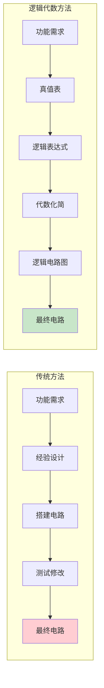
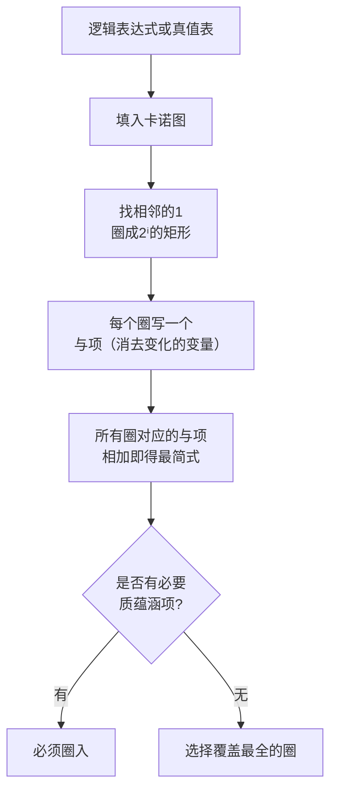

## 第二章：逻辑代数基础

### 2.1 基本逻辑运算与公式定律

#### ① 核心概念

**一句话总结：**
> 逻辑代数（布尔代数）是数字电路的数学基础，用0和1表示真/假，用与/或/非三种基本运算描述所有逻辑关系——就像算术用+-×描述数值关系。

**生活类比：**
- **与门（AND）**：串联网关——两把钥匙同时插入才能开门（两个条件都满足）
- **或门（OR）**：并联网关——两个开关任意一个闭合灯就亮（至少一个条件满足）
- **非门（NOT）**：反向阀——平时开着的门，按下按钮就关（取反）

**用数学的视角理解：**
逻辑代数和普通代数的区别：

| 特性 | 普通代数 | 逻辑代数 |
|:----:|:---------|:---------|
| 变量取值 | 任意实数 | 仅0和1 |
| 基本运算 | +, -, ×, ÷ | 与(·), 或(+), 非(‾) |
| 分配律 | \( a(b+c) = ab+ac \) | 双分配律：\( a+bc = (a+b)(a+c) \) |
| 互补律 | 无 | \( a \cdot \bar{a} = 0,\; a+\bar{a} = 1 \) |

---

#### ② 为什么需要逻辑代数？

**解决什么痛点？**

在没有逻辑代数之前，设计数字电路全靠经验和直觉。逻辑代数提供了：

1. **形式化描述**：任何一个数字电路的功能都可以用逻辑表达式精确描述
2. **数学化分析**：可以像解方程一样分析和化简电路
3. **最优化设计**：通过化简，用最少的门电路实现相同功能，降低成本、功耗
4. **等价性验证**：不同的电路设计是否功能相同？通过逻辑代数可以严格证明



---

#### ③ 基本运算与复合运算

**三种基本运算：**

| 输入 | 与(AND) | 或(OR) | 非(NOT) |
|:----:|:-------:|:------:|:-------:|
| A=0,B=0 | 0 | 0 | — |
| A=0,B=1 | 0 | 1 | — |
| A=1,B=0 | 0 | 1 | — |
| A=1,B=1 | 1 | 1 | — |
| A=0 | — | — | 1 |
| A=1 | — | — | 0 |

**记忆口诀：** 与——有0出0，全1出1；或——有1出1，全0出0；非——0变1，1变0

**复合运算（重点）：**

| 运算 | 符号 | 表达式 | 口诀 |
|:----:|:----:|:-------|:-----|
| 与非 | ↑ 或 \(\overline{\cdot}\) | \( \overline{A \cdot B} \) | 有0出1，全1出0 |
| 或非 | ↓ 或 \(\overline{+}\) | \( \overline{A + B} \) | 有1出0，全0出1 |
| 异或 | ⊕ | \( A\bar{B} + \bar{A}B \) | 相异出1，相同出0 |
| 同或 | ⊙ | \( AB + \bar{A}\bar{B} \) | 相同出1，相异出0 |

**常用公式定律：**

| 分类 | 公式 | 说明 |
|:----:|:-----|:-----|
| **0-1律** | \( A\cdot 0 = 0,\; A\cdot 1 = A \) | 与运算的"吸收" |
| | \( A+0 = A,\; A+1 = 1 \) | 或运算的"饱和" |
| **重叠律** | \( A\cdot A = A,\; A+A = A \) | 没有次数概念（不像代数） |
| **互补律** | \( A\cdot \bar{A} = 0,\; A+\bar{A} = 1 \) | 矛盾律和排中律 |
| **吸收律** | \( A + AB = A \) | —— |
| | \( A(A+B) = A \) | —— |
| | \( A + \bar{A}B = A + B \) | **重要！** |
| **冗余律** | \( AB + \bar{A}C + BC = AB + \bar{A}C \) | 冗余项可消去 |
| **摩根定律** | \( \overline{A \cdot B} = \bar{A} + \bar{B} \) | 与非 ↔ 或非 |
| | \( \overline{A + B} = \bar{A} \cdot \bar{B} \) | 或非 ↔ 与非 |

---

#### ④ 例题详解

**例题1**：证明 \( A + \bar{A}B = A + B \)

**代数证明**：
\[
A + \bar{A}B = (A + \bar{A})(A + B) \quad (\text{分配律})
\]
\[
= 1 \cdot (A + B) \quad (\text{互补律})
\]
\[
= A + B
\]

**真值表验证**：

| A | B | \( \bar{A} \) | \( \bar{A}B \) | \( A + \bar{A}B \) | \( A + B \) |
|:-:|:-:|:---:|:---:|:---:|:---:|
| 0 | 0 | 1 | 0 | 0 | 0 |
| 0 | 1 | 1 | 1 | 1 | 1 |
| 1 | 0 | 0 | 0 | 1 | 1 |
| 1 | 1 | 0 | 0 | 1 | 1 |

两列结果相同，证毕。

**例题2**：用摩根定律将 \( F = \overline{A + B \cdot \overline{C}} \) 展开。

**解**：
\[
F = \overline{A + B \cdot \overline{C}} = \overline{A} \cdot \overline{B \cdot \overline{C}} \quad (\text{摩根定律})
\]
\[
= \overline{A} \cdot (\overline{B} + \overline{\overline{C}}) \quad (\text{摩根定律再展开})
\]
\[
= \overline{A} \cdot (\overline{B} + C) = \overline{A}\,\overline{B} + \overline{A}C
\]

**例题3**：化简 \( F = AB + \overline{A}C + BC \)

**解**：
由冗余律 \( AB + \overline{A}C + BC = AB + \overline{A}C \)
（因为若A=1则AB决定，A=0则\(\overline{A}C\)决定，BC是冗余的）

验证：当 A=1,B=1,C=0 时，原式=1+0+0=1；化简式=1+0=1 ✓
当 A=0,B=1,C=1 时，原式=0+1+1=1；化简式=0+1=1 ✓

---

#### ⑤ 练习题

**基础题：**

1. 用真值表证明 \( A(A+B) = A \)
2. 化简 \( F = \overline{A}BC + A\overline{B}C + AB\overline{C} + ABC \)
3. 用摩根定律展开 \( \overline{A + \overline{B}C} \)

**进阶题：**

4. 证明 \( A \oplus B = \overline{A \odot B} \)（异或和同或互为非关系）
5. 化简 \( F = (\overline{A} + B)(A + \overline{B})(\overline{A} + \overline{B}) \)

**解答提示：**
> 题2：\( AB + AC + BC \)（三变量多数表决函数）
> 题3：\( \bar{A}B + \bar{A}\bar{C} \)
> 题5：\( \overline{A}\,\overline{B} \)

---

### 2.2 逻辑函数的标准形式

#### ① 核心概念

**一句话总结：**
> 任何一个逻辑函数都可以写成"最小项之和"或"最大项之积"的标准形式——这是逻辑函数的"身份证"，有了它，不同函数之间可以精确对比和转换。

**前置概念：**

```mermaid
flowchart TD
    A[真值表] --> B[取F=1的行]
    A --> C[取F=0的行]
    B --> D[每个F=1的行对应一个最小项]
    C --> E[每个F=0的行对应一个最大项]
    D --> F[最小项之和: F=∑m(...)]
    E --> G[最大项之积: F=∏M(...)]
    F --> H[两者等价<br/>可通过摩根定律互转]
    G --> H
```

**最小项（minterm）：**
- n个变量的最小项是包含全部n个变量的**与项**，每个变量以原变量或反变量出现一次
- 共 \( 2^n \) 个最小项，记为 \( m_0, m_1, \ldots, m_{2^n-1} \)
- 下标规则：原变量→1，反变量→0
- 性质：任意两个不同最小项的与=0；全部最小项的和=1

**最大项（maxterm）：**
- n个变量的最大项是包含全部n个变量的**或项**，每个变量以原变量或反变量出现一次
- 共 \( 2^n \) 个最大项，记为 \( M_0, M_1, \ldots, M_{2^n-1} \)
- 下标规则：原变量→0，反变量→1（与最小项相反！）
- 性质：任意两个不同最大项的或=1；全部最大项的积=0

---

#### ② 最小项与最大项的关系

**核心关系：**
\[
m_i = \overline{M_i},\quad M_i = \overline{m_i}
\]

**已知最小项之和，求最大项之积：**
若 \( F = \sum m(i,j,k) \)，则 \( F = \prod M(p,q,r) \)，其中 \( p,q,r \) 是下标集合的**补集**。

**例题4**：已知三变量函数 \( F(A,B,C) = \sum m(0,2,5,7) \)，求最大项之积。

**解**：
3变量共有 8 个最小项（编号0~7）。F包含0,2,5,7，则F不包含的为1,3,4,6。
\[
F = \prod M(1,3,4,6)
\]
\[
= (A+B+\overline{C})(A+\overline{B}+\overline{C})(\overline{A}+B+C)(\overline{A}+\overline{B}+C)
\]

验证：最小项之和与最大项之积是同一函数的两种等价形式。

---

#### ③ 例题详解

**例题5**：写出三变量函数 \( F = AB + \overline{A}C \) 的最小项之和形式。

**解**：
展开法（补全缺失的变量）：
\[
F = AB(C + \overline{C}) + \overline{A}C(B + \overline{B})
\]
\[
= ABC + AB\overline{C} + \overline{A}BC + \overline{A}\,\overline{B}C
\]
\[
= m_7 + m_6 + m_3 + m_1
\]
\[
= \sum m(1,3,6,7)
\]

真值表验证：

| A | B | C | \( AB \) | \( \overline{A}C \) | F |
|:-:|:-:|:-:|:--------:|:-----------------:|:-:|
| 0 | 0 | 0 | 0 | 0 | 0 |
| 0 | 0 | 1 | 0 | 1 | 1 → m₁ |
| 0 | 1 | 0 | 0 | 0 | 0 |
| 0 | 1 | 1 | 0 | 1 | 1 → m₃ |
| 1 | 0 | 0 | 0 | 0 | 0 |
| 1 | 0 | 1 | 0 | 0 | 0 |
| 1 | 1 | 0 | 1 | 0 | 1 → m₆ |
| 1 | 1 | 1 | 1 | 0 | 1 → m₇ |

---

#### ④ 练习题

1. 写出三变量函数 \( F = A + BC \) 的最小项之和形式。
2. 已知 \( F(A,B,C) = \sum m(0,1,2,4) \)，写出最大项之积形式。
3. 已知 \( F(A,B,C) = \prod M(0,3,5,6) \)，写出最小项之和形式。
4. 证明最小项性质：\( m_i \cdot m_j = 0 \)（当 i ≠ j）。

**解答提示：**
> 题1：\( \sum m(3,4,5,6,7) \)；题2：\( \prod M(3,5,6,7) \)

---

### 2.3 卡诺图化简法

#### ① 核心概念

**一句话总结：**
> 卡诺图是真值表的二维图形化排列，利用"相邻的格子只有一个变量不同"的特性，通过"圈1"实现直观的逻辑化简——圈越大，消去的变量越多，结果越简。



#### ② 卡诺图结构

**二变量（4格）：**

```
       B
      0   1
   +---+---+
A 0 |m0 |m1 |
   +---+---+
  1 |m2 |m3 |
   +---+---+
```

**三变量（8格）：**

```
       BC
       00  01  11  10
   +----+---+---+---+
A 0 | m0 | m1 | m3 | m2 |
   +----+---+---+---+
  1 | m4 | m5 | m7 | m6 |
   +----+---+---+---+
```

> **注意**：列序是 00→01→11→10（格雷码顺序），不是自然数顺序！

**四变量（16格）：**

```
       CD
       00  01  11  10
   +----+---+---+---+
AB 00 |m0 |m1 |m3 |m2 |
   +----+---+---+---+
  01 |m4 |m5 |m7 |m6 |
   +----+---+---+---+
  11 |m12|m13|m15|m14|
   +----+---+---+---+
  10 |m8 |m9 |m11|m10|
   +----+---+---+---+
```

---

#### ③ 化简规则

**核心规则：**
1. 相邻（上下左右）的 \( 2^i \) 个1可以圈在一起，消去 i 个变量
2. 每个圈必须是矩形或正方形，边长为 \( 2^i \)
3. **卡诺图是循环相邻的**——左右相邻、上下相邻、四角相邻
4. 圈可以重叠，但每个1必须至少被圈一次
5. 先找孤立的1（只能圈自己），再找必要的圆形覆盖

**化简步骤：**
1. 将函数填入卡诺图（在最小项对应的格子填1）
2. 找出所有**质蕴涵项**（不能再扩大的矩形圈）
3. 找出**必要质蕴涵项**（只被它覆盖的1所在的圈）
4. 用必要质蕴涵项覆盖所有1，若还有剩余1，选覆盖最多的质蕴涵项

**化简结果的形式：** 最简与-或式（与项之和）

---

#### ④ 例题详解

**例题6**：用卡诺图化简 \( F(A,B,C) = \sum m(0,1,2,5,7) \)

**解**：

三变量卡诺图填入：

```
       BC
       00  01  11  10
   +----+---+---+---+
A 0 | 1  | 1 | 0 | 1 |
   +----+---+---+---+
  1 | 0  | 1 | 1 | 0 |
   +----+---+---+---+
      m0  m1  m3  m2
      m4  m5  m7  m6
```

**圈图：**
- 圈1：m0(000)和m2(010)相邻 → 消去B → \( \overline{A}\,\overline{C} \)
- 圈2：m1(001)和m5(101)相邻？不，m1(001)在A=0行，m5(101)在A=1行，列都是01，所以上下相邻！→ 消去A → \( \overline{B}C \)
- 圈3：m5(101)和m7(111)相邻 → 消去B → \( AC \)

检查覆盖：m0(圈1), m1(圈2), m2(圈1), m5(圈2和圈3), m7(圈3) ✓

\[
F = \overline{A}\,\overline{C} + \overline{B}C + AC
\]

进一步化简 \( \overline{B}C + AC = C(\overline{B} + A) \)，但已经是与-或形式，保留最简与-或式。

实际上，m5被两个圈覆盖，尝试更大圈：m1,m3,m5,m7构成一个矩形2×2？m1(001), m3(011), m5(101), m7(111) → 第1列和第3列，B变化，A变化 → 消去A和B → 剩余C。所以可以圈m1,m3,m5,m7为 \( C \)。

重新圈图：
- 圈1(大圈)：m1(001), m3(011), m5(101), m7(111) → C
- 圈2：m0(000), m2(010) → \( \overline{A}\,\overline{C} \)

\[
F = C + \overline{A}\,\overline{C} = C + \overline{A} \quad (\text{由吸收律})
\]

验证真值表：

| A | B | C | 原式 | 化简式 |
|:-:|:-:|:-:|:----:|:------:|
| 0 | 0 | 0 | 1 | 1 |
| 0 | 0 | 1 | 1 | 1 |
| 0 | 1 | 0 | 1 | 1 |
| 0 | 1 | 1 | 0 | 0 |
| 1 | 0 | 0 | 0 | 0 |
| 1 | 0 | 1 | 1 | 1 |
| 1 | 1 | 0 | 0 | 0 |
| 1 | 1 | 1 | 1 | 1 |

✓ 一致！

---

**例题7**：用卡诺图化简 \( F(A,B,C,D) = \sum m(0,2,3,5,7,8,10,11,13,15) \)

**解**：

四变量卡诺图：

```
            CD
      00  01  11  10
   +----+---+---+---+
AB 00 | 1 | 0 | 0 | 1 |  m0,m1,m3,m2
   +----+---+---+---+
  01 | 0 | 1 | 1 | 0 |  m4,m5,m7,m6
   +----+---+---+---+ 
  11 | 0 | 1 | 1 | 0 |  m12,m13,m15,m14
   +----+---+---+---+
  10 | 1 | 0 | 0 | 1 |  m8,m9,m11,m10
   +----+---+---+---+
```

**找质蕴涵项：**

- 圈1（四角）：m0(0000), m2(0010), m8(1000), m10(1010)
  - A和B变化（从AB=00到10），C不变=0，D变化 → 消去A和D → \( \overline{B}\,\overline{C} \)
  - 等等，更准确：A从0→1(变化)，B恒为0，C恒为0，D从0→1(变化) → 消去A和D → \( \overline{B}\,\overline{C} \)

- 圈2（中间竖条）：m3(0011), m7(0111), m11(1011), m15(1111)
  - A和B变化，C=1, D=1 → 消去A和B → \( CD \)

- 圈3（中间右2列上下2行）：m5(0101), m7(0111), m13(1101), m15(1111)
  - 这个圈是否有效？m5,m7,m13,m15: AB从01→11(变化A), C=1, D变化 → 消去A和D → \( BC \)

但注意m7和m15已被圈2覆盖。检查必要性：
- m3只被圈2覆盖 → 圈2必要
- m5只被圈3覆盖 → 圈3必要
- m0, m2, m8, m10只被圈1覆盖 → 圈1必要

所以：
\[
F = \overline{B}\,\overline{C} + CD + BC
\]

可进一步化简：\( CD + BC = C(D+B) \) → 但保持与-或形式。

---

#### ⑤ 带有无关项（Don't Care）的化简

实际电路中，某些输入组合不会出现，或输出值无关紧要。用 \( \times \) 或 \( \phi \) 表示，可灵活视为0或1以简化表达式。

**例题8**：化简 \( F(A,B,C,D) = \sum m(0,2,4,6,8,10) \)，无关项 \( d = \sum m(12,13,14,15) \)

**解**：

填入卡诺图（d表示无关项，可当1用）：

```
            CD
      00  01  11  10
   +----+---+---+---+
AB 00 | 1 | 0 | 0 | 1 |
   +----+---+---+---+
  01 | 1 | 0 | 0 | 1 |
   +----+---+---+---+
  11 | d | d | d | d |
   +----+---+---+---+
  10 | 1 | 0 | 0 | 1 |
   +----+---+---+---+
```

**圈图（利用无关项）：**
- 利用d把整个AB=11行全部当1看 → 圈所有d和上面已有的1
- 看列：CD=00,10都形成了4个1的矩形（含d）

实际上，观察：所有1都在CD=00或CD=10列。利用d，可以将m12,m14与m0,m2,m4,m6,m8,m10合并。

圈1：CD=00的整列（m0,m4,m8,m12→将m12视为1）→ \( \overline{C}\,\overline{D} \)  
圈2：CD=10的整列（m2,m6,m10,m14→将m14视为1）→ \( C\overline{D} \)

\[
F = \overline{C}\,\overline{D} + C\overline{D} = \overline{D}
\]

分析：所有1都在D=0的行（CD=00和10），D=1的列都是0或d，所以函数确实简化为 \( \overline{D} \)。

---

#### ⑥ "圈0"法（求最简或-与式）

有时圈0比圈1更简便。圈0得到的是 \( \overline{F} \) 的最简式，再取反即得F的或-与式。

**例题9**：用"圈0"法求 \( F(A,B,C) = \sum m(0,1,2,4) \) 的最简或-与式。

**解**：

F包含m0,m1,m2,m4，所以F=0的项为m3,m5,m6,m7。

卡诺图（标记0）：

```
       BC
       00  01  11  10
   +----+---+---+---+
A 0 | 1 | 1 | 0 | 1 |
   +----+---+---+---+
  1 | 1 | 0 | 0 | 0 |
   +----+---+---+---+
```

圈0：m3(011), m7(111) 相邻 → 消去B → \( A\overline{C} \)  
圈0：m5(101), m7(111) 相邻 → 消去A → \( BC \)  
圈0：m6(110), m7(111) 相邻 → 消去C → \( AB \)

\[
\overline{F} = A\overline{C} + BC + AB
\]

取反：
\[
F = \overline{A\overline{C} + BC + AB} = (\overline{A}+C)(\overline{B}+\overline{C})(\overline{A}+\overline{B})
\]

---

#### ⑦ 练习题

**基础题：**

1. 用卡诺图化简 \( F(A,B,C) = \sum m(3,4,5,6) \)
2. 用卡诺图化简 \( F(A,B,C) = \sum m(0,1,3,5,7) \)
3. 用卡诺图化简 \( F(A,B,C,D) = \sum m(0,1,2,3,8,9,10,11) \)

**进阶题：**

4. 用卡诺图化简 \( F(A,B,C,D) = \sum m(0,1,4,5,9,11,13,15) \)，无关项 \( d(2,3,6,7) \)
5. 用卡诺图分别用圈1法和圈0法化简 \( F = \overline{A}B + A\overline{B}C + \overline{A}\,\overline{B}\,\overline{C} \)，比较两种结果是否等价。

**解答提示：**
> 题1：\( \overline{A}B + AB + AC \) → 化简为 \( B + AC \)
> 题2：\( \overline{B} + C \)
> 题3：\( \overline{B} \)
