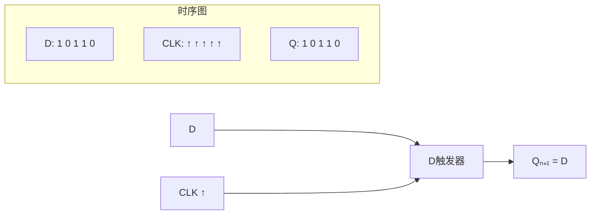
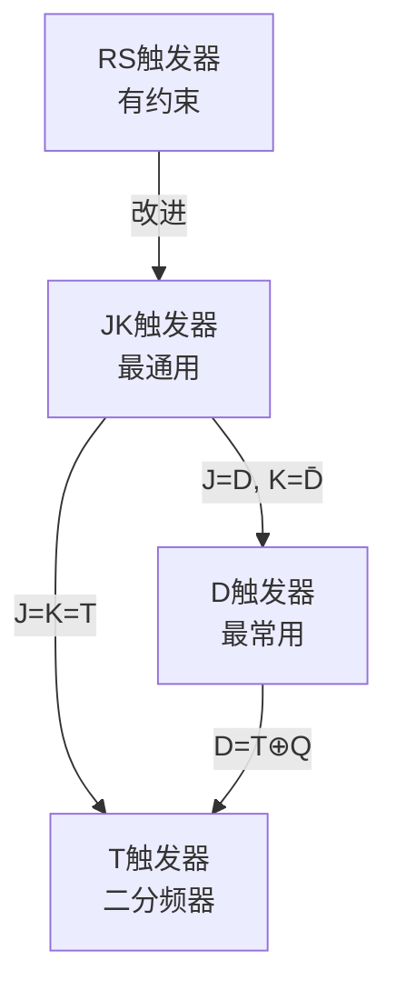
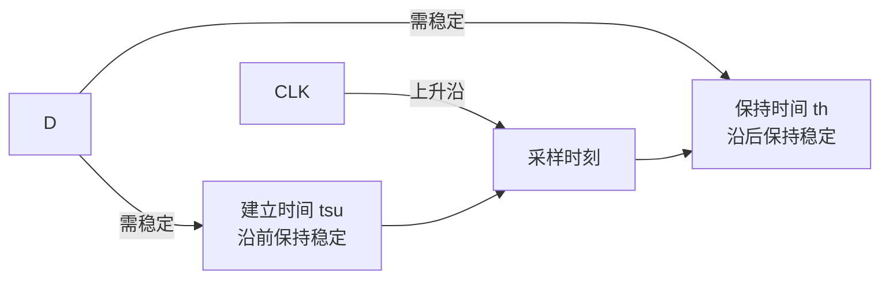

## 第五章：触发器

### 5.1 基本RS触发器

#### ① 核心概念

**一句话总结：**
> 触发器是数字电路中**最基本的存储单元**，能存储1位二进制信息（0或1）；基本RS触发器由两个与非门（或两个或非门）交叉耦合构成，是触发器家族的"始祖"。

**生活类比：**
- **基本RS触发器** = 一个"双稳态开关"——按下S端（置位）→ 输出Q=1；按下R端（复位）→ 输出Q=0；都不按时→保持之前状态

```mermaid
flowchart TD
    subgraph 基本RS触发器结构
        G1[与非门G₁] -->|Q| G2[与非门G₂]
        G2 -->|Q̄| G1
        S̄ --> G1
        R̄ --> G2
    end
    subgraph 逻辑符号
        L[基本RS触发器] -->|Q| Qout[Q]
        L -->|Q̄| Qbout[Q̄]
        S̄ --> L
        R̄ --> L
    end
```

**电路结构分析：**

两个与非门交叉反馈：
- G₁输出 = \( \overline{\overline{S} \cdot \overline{Q}} = \overline{\overline{S}} + Q = S + Q \)
- G₂输出 = \( \overline{\overline{R} \cdot Q} \)

由于\( \overline{Q} \) = G₂输出，代入得：
- \( Q = \overline{\overline{S} \cdot \overline{Q}} \)
- \( \overline{Q} = \overline{\overline{R} \cdot Q} \)

#### ② 状态转换与约束条件

| \( \overline{S} \) | \( \overline{R} \) | Q | \( \overline{Q} \) | 功能 |
|:-:|:-:|:-:|:-:|:----|
| 1 | 1 | 保持原状态 | 保持 | 保持 |
| 1 | 0 | 0 | 1 | 复位(置0) |
| 0 | 1 | 1 | 0 | 置位(置1) |
| 0 | 0 | 1 | 1 | **禁止！**（破坏互补关系） |

**特性方程：**
\[
Q_{n+1} = \overline{R} + S \cdot Q_n
\]
约束条件：\( \overline{R} + \overline{S} \neq 0 \)（即 \( \overline{R} \)和\(\overline{S}\)不能同时为0，等价于 \( R + S = 1 \)）

**例题1**：基本RS触发器的初始Q=0，输入序列 \( \overline{S}=1\to0\to1\to1\to1 \)，\( \overline{R}=1\to1\to1\to0\to1 \)，画出Q波形。

**解**：
- 初始：\( \overline{S}=1,\overline{R}=1 \) → Q保持0
- t₁：\( \overline{S}=0,\overline{R}=1 \) → 置位 → Q=1
- t₂：\( \overline{S}=1,\overline{R}=1 \) → Q保持1
- t₃：\( \overline{S}=1,\overline{R}=0 \) → 复位 → Q=0
- t₄：\( \overline{S}=1,\overline{R}=1 \) → Q保持0

---

### 5.2 钟控触发器

#### ① 核心概念

**一句话总结：**
> 钟控触发器在基本RS触发器基础上增加了**时钟控制端（CLK）**，只有在时钟有效时才接收输入——这样多个触发器可以同步工作。

**为什么需要时钟？**
- 基本RS触发器的输入信号任何时候都可能改变状态
- 数字系统中往往需要多个触发器同时"采样"输入（同步工作）
- 时钟信号就像一个"节拍器"，统一指挥所有触发器的工作节奏

#### ② 四种常用触发器

**（1）钟控RS触发器**

| CLK | R | S | Qₙ₊₁ | 功能 |
|:---:|:-:|:-:|:----:|:----|
| 0 | × | × | Qₙ | 保持 |
| 1 | 0 | 0 | Qₙ | 保持 |
| 1 | 0 | 1 | 1 | 置位 |
| 1 | 1 | 0 | 0 | 复位 |
| 1 | 1 | 1 | × | 禁止 |

特性方程：\( Q_{n+1} = S + \overline{R}Q_n \)，约束：\( RS = 0 \)

**（2）D触发器（最常用！）**

**一句话总结：**
> D触发器只有一个数据输入端D，在时钟有效沿将D的值"锁存"到输出——就像"延迟一拍"。

| CLK | D | Qₙ₊₁ |
|:---:|:-:|:----:|
| ↑ | 0 | 0 |
| ↑ | 1 | 1 |
| 非↑ | × | Qₙ |

特性方程：\( Q_{n+1} = D \)



**（3）JK触发器（最完备！）**

**一句话总结：**
> JK触发器解决了RS触发器输入都为1时的禁止问题——J=K=1时输出翻转，功能最完备。

| CLK | J | K | Qₙ₊₁ | 功能 |
|:---:|:-:|:-:|:----:|:----|
| ↑ | 0 | 0 | Qₙ | 保持 |
| ↑ | 0 | 1 | 0 | 复位 |
| ↑ | 1 | 0 | 1 | 置位 |
| ↑ | 1 | 1 | \( \overline{Q_n} \) | 翻转 |

特性方程：
\[
Q_{n+1} = J\overline{Q_n} + \overline{K}Q_n
\]

**（4）T触发器**

| CLK | T | Qₙ₊₁ |
|:---:|:-:|:----:|
| ↑ | 0 | Qₙ |
| ↑ | 1 | \( \overline{Q_n} \) |

特性方程：\( Q_{n+1} = T \oplus Q_n = T\overline{Q_n} + \overline{T}Q_n \)

**四种触发器的关系：**



#### ③ 触发方式

| 方式 | 特点 | 波形 |
|:----|:-----|:-----|
| **电平触发** | CLK=1(或0)期间接收输入 | 整个高电平期间敏感 |
| **边沿触发** | 只在CLK上升沿(或下降沿)采样 | 只在边沿瞬间采样 |
| **主从触发** | 主触发器CLK=1时接收，从触发器CLK=0时输出 | 防抖，但有一致变化问题 |

**边沿触发器的建立时间和保持时间：**



**例题2**：D触发器初始Q=0，CLK上升沿触发，D序列为 1 0 0 1 1 0，求Q输出。

**解**：每个上升沿将D传到Q，Q输出 = 上一拍的D值。

| 时钟周期 | D | Q |
|:-------:|:-:|:-:|
| 初始 | — | 0 |
| 第1个↑ | 1 | 1 |
| 第2个↑ | 0 | 0 |
| 第3个↑ | 0 | 0 |
| 第4个↑ | 1 | 1 |
| 第5个↑ | 1 | 1 |
| 第6个↑ | 0 | 0 |

---

### 5.3 触发器的相互转换

#### ① 核心方法

**转换公式：**
\[
\text{已有触发器激励方程} = \frac{\text{目标触发器特性方程}}{\text{已有触发器特性方程}}
\]

**基本步骤：**
1. 写出目标触发器的特性方程
2. 写出已有触发器的特性方程
3. 将两者联立，解出已有触发器输入端的表达式
4. 画出转换电路

#### ② 常见转换

**JK → D：**
D特性：\( Q_{n+1} = D \)
JK特性：\( Q_{n+1} = J\overline{Q_n} + \overline{K}Q_n \)
令 \( D = J\overline{Q_n} + \overline{K}Q_n \)
所以 \( J = D, K = \overline{D} \)

**JK → T：**
T特性：\( Q_{n+1} = T \oplus Q_n = T\overline{Q_n} + \overline{T}Q_n \)
对比得 \( J = T, K = T \)（J、K短接作T）

**D → JK：**
令 \( D = J\overline{Q_n} + \overline{K}Q_n \)
在D端前加组合逻辑：

```mermaid
flowchart LR
    J --> AND1[与门1]
    Q̄ --> AND1
    K --> NOT[非门]
    NOT --> AND2[与门2]
    Q --> AND2
    AND1 --> OR[或门]
    AND2 --> OR
    OR --> D[D端]
    D --> DFF[D触发器]
```

**D → T：**
\( D = T \oplus Q_n \)，用异或门实现。

---

### 5.4 练习题

**基础题：**

1. 基本RS触发器输入 \( \overline{S} = 0, \overline{R} = 1 \) 时，输出Q是多少？输入 \( \overline{S} = 1, \overline{R} = 1 \) 时呢？
2. JK触发器初始Q=0，J=1, K=1，连续到来3个时钟脉冲后，Q的最终值是多少？
3. 将D触发器转换为T触发器的电路图是什么？

**进阶题：**

4. 下图所示电路中，各D触发器初始为0，画出连续8个时钟脉冲的Q₀Q₁Q₂波形。
   （连接方式：Q₀→D₁, Q₁→D₂, 三个触发器CLK并联，D₀ = \( \overline{Q_2} \)）
   提示：这是一个3位二进制计数器。
5. 基本RS触发器的约束条件 \( \overline{R} + \overline{S} \neq 0 \) 意味着什么？如果不满足会发生什么？
6. 为什么边沿触发器在现代数字系统中被广泛采用，而不是电平触发器？

**解答提示：**
> 题1：Q=1, Q保持1
> 题2：J=K=1时每个CLK翻转一次，3个脉冲后Q=1（实际上：0→1→0→1）
> 题3：D = T ⊕ Q
> 题4：这是一个环形移位计数器，8个脉冲后回到初始状态。Q₂Q₁Q₀的序列为：000→100→110→111→011→001→000→...（具体取决于连接方式）
> 题5：约束条件是S̄和R̄不能同时为0（即不能同时有效），否则Q=Q̄=1，破坏了互补关系。
