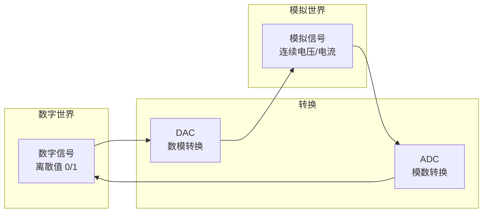
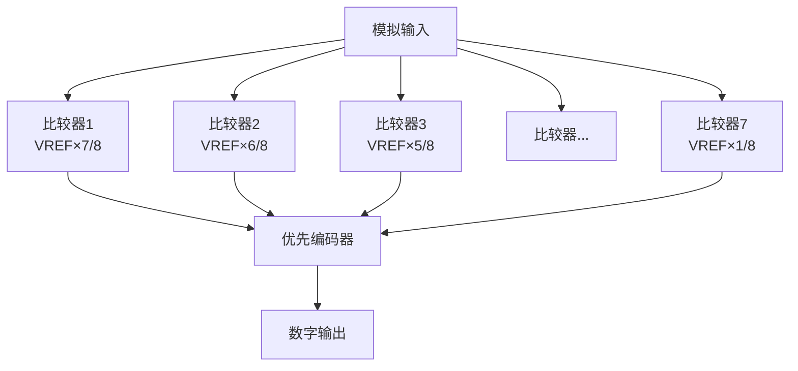
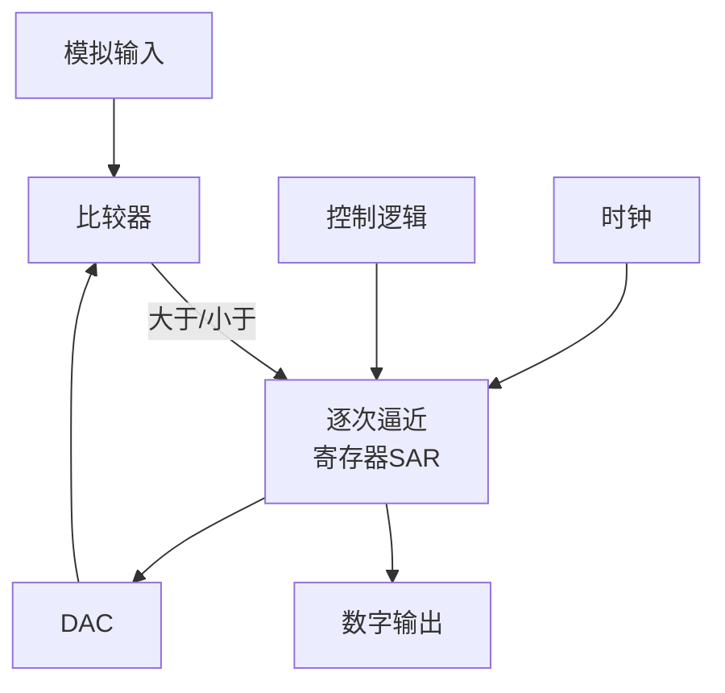
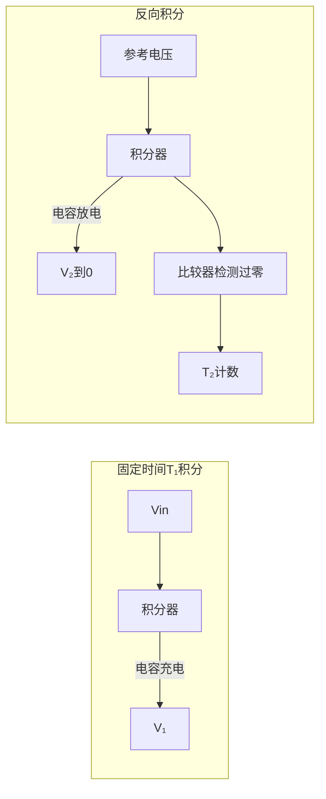
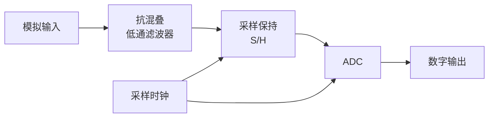

## 第八章：数模与模数转换

### 8.1 概述

#### ① 核心概念

**一句话总结：**
> DAC将数字信号转换为模拟信号（电压/电流），ADC则反之——它们是数字世界与模拟世界之间的"翻译官"。



**典型应用场景：**

| 场景 | 使用DAC | 使用ADC |
|:----|:--------|:--------|
| 音频系统 | 数字音频→模拟声音 | 麦克风声音→数字音频 |
| 传感器采集 | — | 温度/压力→数字值 |
| 信号发生器 | 数字波形→模拟波形 | — |
| 电机控制 | 数字控制量→模拟电压 | — |
| 数据采集卡 | — | 模拟信号→数字数据 |

#### ② 关键性能指标

**分辨率（Resolution）：**
- n位DAC/ADC有 \( 2^n \) 个可能的输出/输入值
- 最小分辨电压：\( V_{LSB} = \frac{V_{REF}}{2^n} \)
- 例：8位ADC, \( V_{REF} = 5V \)，分辨率 = \( \frac{5}{256} \approx 19.53mV \)

**转换精度（Accuracy）：**
- 实际转换结果与理想值的偏差
- 包括：偏移误差、增益误差、线性误差（INL、DNL）
- 通常用LSB的倍数表示（如 ±½LSB）

**转换速度（Speed）：**
- ADC：从开始采样到输出有效数字所需的时间（转换时间）
- DAC：从数字输入变化到输出稳定的时间（建立时间）

| 性能 | DAC | ADC |
|:----|:----|:-----|
| 分辨率 | n位，典型8~24位 | n位，典型8~24位 |
| 转换速度 | ~10ns~10μs | ~1ns~1ms |
| 精度 | 一般较高 | 受量化误差限制 |

**量化误差（Quantization Error）：**
ADC将连续模拟值映射到离散数字值时的固有误差，范围为 ±½LSB。

---

### 8.2 DAC（数模转换器）

#### ① R-2R倒T形电阻网络DAC

**一句话总结：**
> R-2R倒T形电阻网络是最常用的DAC结构——只用R和2R两种电阻，便于集成，转换速度较快。

**电路结构：**

```
参考电压 VREF ──┬─ 2R ──┬─ 2R ──┬─ 2R ──┬─ 2R ── 地
               │       │       │       │
               R       R       R       R
               │       │       │       │
               ↓       ↓       ↓       ↓
         S₃(MSB)   S₂      S₁      S₀(LSB)
               │       │       │       │
               └───┬───┴───┬───┴───┬───┘
                   │
                   → 运算放大器（求和） → Vout
```

**输出电压公式：**
\[
V_{out} = -\frac{V_{REF}}{2^n} \sum_{i=0}^{n-1} D_i \cdot 2^i
\]
其中 \( D_i \in \{0, 1\} \) 为第i位数字输入。

**例题1**：8位DAC，\( V_{REF} = 5V \)，输入数字D=10110100₂（=180₁₀），求输出电压。

**解**：
\[
V_{out} = -\frac{5}{2^8} \times 180 = -\frac{5}{256} \times 180 \approx -3.516V
\]

**例题2**：12位DAC，要求最小输出电压变化为 1mV，参考电压应为多少？

**解**：
\[
V_{LSB} = \frac{V_{REF}}{2^{12}} = \frac{V_{REF}}{4096} = 0.001V
\]
\[
V_{REF} = 0.001 \times 4096 = 4.096V
\]

#### ② 权电阻网络DAC

**原理：** 每位数字对应一个权值电阻，电阻值与 \( 2^{n-1-i} \) 成正比。

**问题：** 电阻值跨度太大（如8位DAC最大电阻是最小电阻的128倍），难以集成。

**对比：**

| 类型 | 电阻值种类 | 精度 | 集成难度 |
|:----|:----------|:----|:---------|
| 权电阻型 | n种不同电阻 | 较高 | 大（电阻匹配难） |
| R-2R倒T型 | 仅R和2R两种 | 高 | 小（比值精度高） |

**结论：R-2R型是主流。**

#### ③ DAC的性能指标

| 指标 | 定义 | 典型值 |
|:----|:-----|:------:|
| 分辨率 | 位数n | 8~24位 |
| 建立时间 | 输出达到±½LSB所需时间 | 0.1~10μs |
| INL（积分非线性） | 实际传输特性与理想直线的最大偏差 | ±0.5~±2LSB |
| DNL（微分非线性） | 相邻码间实际步长与理想步长的偏差 | ±0.5~±1LSB |
| 单调性 | 数字码增加时输出是否单调增加 | 单调性=无DNL>1LSB |

---

### 8.3 ADC（模数转换器）

#### ① 并联比较型ADC（Flash ADC）

**一句话总结：**
> 并联比较型ADC用 \( 2^n - 1 \) 个比较器同时比较输入电压——速度最快，但分辨率提高时硬件成本指数增长。



**3位Flash ADC示例（VREF=8V，Vin=6.2V）：**

| 比较器 | 阈值 | 输出 |
|:------:|:----:|:----:|
| C1 | 7V | 0（6.2 < 7） |
| C2 | 6V | 1（6.2 > 6） |
| C3 | 5V | 1 |
| C4 | 4V | 1 |
| C5 | 3V | 1 |
| C6 | 2V | 1 |
| C7 | 1V | 1 |

编码器输入：0111111 → 输出：110（对应6V）

**特点：**
- 速度：一个时钟周期完成（最快！）
- 缺点：n位需要 \( 2^n - 1 \) 个比较器，8位需要255个，10位需要1023个
- 应用：超高速数据采集（通信基站、雷达）

#### ② 逐次逼近型ADC（SAR ADC）

**一句话总结：**
> 逐次逼近型ADC采用"二分法"逐位比较——像天平称重，从最重砝码开始逐次尝试，是中速中精度ADC的主流。



**转换过程（3位SAR ADC, VREF=8V, Vin=6.2V）：**

| 步骤 | SAR猜测 | DAC输出 | 比较 | 该位保留？ |
|:----:|:-------:|:-------:|:----:|:---------:|
| 1 | 100 (MSB=1) | 4V | 6.2 > 4 ✅ | 保留1 |
| 2 | 110 (次高位=1) | 6V | 6.2 > 6 ✅ | 保留1 |
| 3 | 111 (LSB=1) | 7V | 6.2 < 7 ❌ | 置0 |

结果：110（对应6V，量化误差0.2V）

**特点：**
- 速度：n个时钟周期完成一次转换
- 精度：分辨率可达16~18位
- 功耗低、面积小
- 应用：数据采集系统、工业控制（最主流）

#### ③ 双积分型ADC

**一句话总结：**
> 双积分型ADC将电压转换为时间进行测量——精度极高、抗干扰强，但速度慢。

**工作原理（两个阶段）：**



**公式：**
\[
T_2 = \frac{V_{in}}{V_{REF}} \cdot T_1
\]
\[
\text{数字输出} = \frac{T_2}{T_{CLK}} = \frac{V_{in}}{V_{REF}} \cdot \frac{T_1}{T_{CLK}}
\]

**特点：**
- 精度极高（可达20位以上）
- 抗干扰能力强（积分过程对噪声取平均）
- 速度极慢（一次转换需要数ms）
- 应用：数字万用表、精密测量仪表

#### ④ 三种ADC对比

| 类型 | 速度 | 精度 | 功耗 | 面积 | 典型应用 |
|:----|:----|:----|:----|:----|:---------|
| 并联型(Flash) | 最快(~GHz) | 低(≤8位) | 高 | 大 | 雷达、高速通信 |
| 逐次逼近(SAR) | 中(~MHz) | 高(≤18位) | 低 | 小 | 工业控制、数据采集 |
| 双积分型 | 慢(~Hz) | 极高(≤24位) | 中 | 中 | 数字万用表、仪表 |

---

### 8.4 ADC的前端——采样保持电路

#### ① 采样定理

**奈奎斯特-香农采样定理：**
\[
f_s \ge 2 \cdot f_{max}
\]
采样频率至少是信号最高频率的2倍，才能无失真地恢复信号。

- \( f_s < 2f_{max} \) → 混叠失真（频率折叠）
- 实际系统通常取 \( f_s > (5 \sim 10) \cdot f_{max} \)

#### ② 抗混叠滤波器

在ADC前必须加低通滤波器，滤除高于 \( f_s/2 \) 的频率分量，防止混叠。



---

### 8.5 练习题

**基础题：**

1. 10位DAC，参考电压3.3V，求分辨率和数字量 1001100110₂ 对应的输出电压。
2. 8位逐次逼近型ADC，参考电压5V，输入电压3.2V，写出逐次逼近过程。
3. 比较Flash ADC和SAR ADC的优缺点。

**进阶题：**

4. 一个12位DAC的DNL为 ±1.5LSB，这意味着什么？这个DAC是否单调？
5. 设计一个用51单片机控制8位DAC产生正弦波的方案（硬件连接+算法思路）。
6. 采样定理：若模拟信号包含0~100kHz的频率分量，ADC的采样频率至少应为多少？实际工程中通常取多少？
7. 为什么双积分型ADC的抗干扰能力比SAR ADC强？

**解答提示：**
> 题1：分辨率VLSB=3.3/1024≈3.22mV，数字量1001100110₂=614₁₀，Vout=3.3×614/1024≈1.98V
> 题2：SAR过程：100(2.5V)→110(3.75V)→101(3.125V)→... 最终结果在101和110之间
> 题3：Flash速度快但面积大功耗高，SAR面积小精度高但速度较慢
> 题6：f_s ≥ 200kHz，实际通常 f_s = 500kHz~1MHz
> 题7：双积分型对输入信号长时间积分，等效于对噪声取平均；SAR在采样瞬间取值，对噪声敏感
