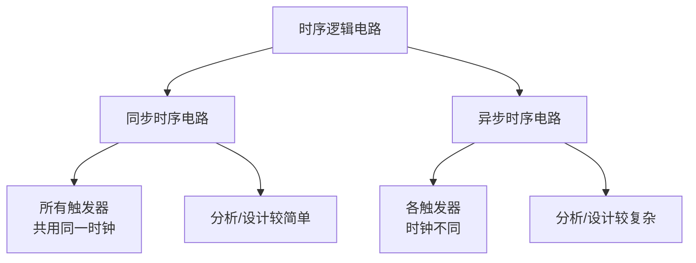
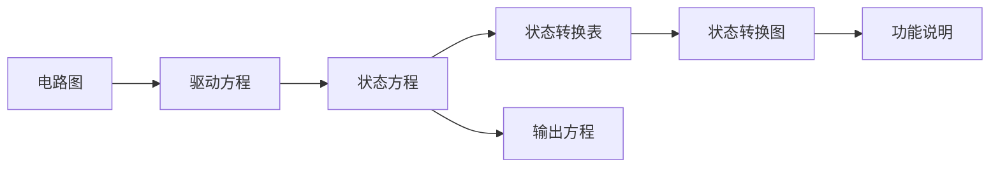
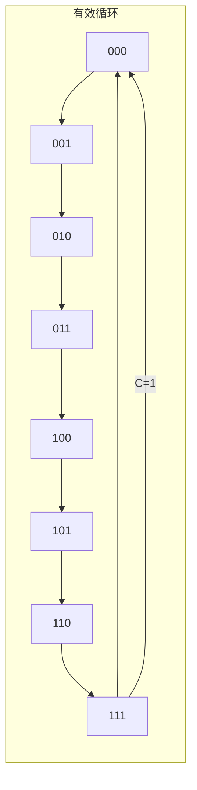
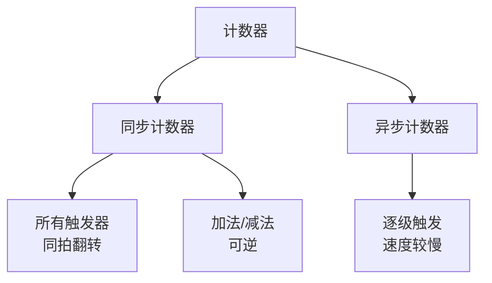
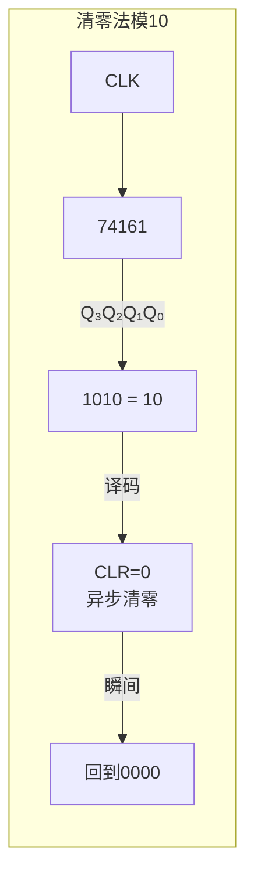
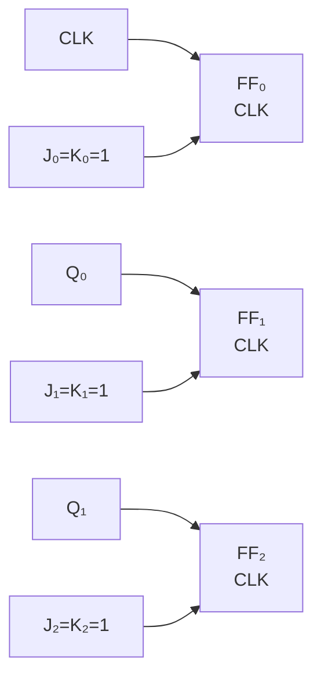
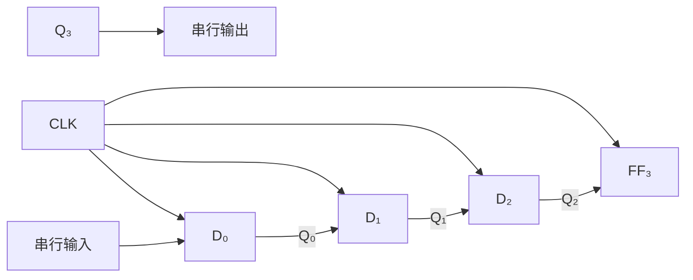

## 第六章：时序逻辑电路

### 6.1 时序逻辑电路的分析方法

#### ① 核心概念

**一句话总结：**
> 时序逻辑电路的输出不仅取决于当前输入，还取决于电路的历史状态（即触发器中存储的内容）——"有记忆"是它和组合逻辑电路的根本区别。

**组合逻辑 vs 时序逻辑：**

```
组合逻辑：   输入 → [门电路] → 输出（无反馈）
时序逻辑：   输入 → [门电路 + 触发器] → 输出
                     ↑         |
                     +--反馈---+
```

**时序电路的分类：**



#### ② 分析标准步骤

1. **写驱动方程**——各触发器输入端的逻辑表达式
2. **写特性方程**——各触发器的类型（D/JK/T）对应的标准方程
3. **写状态方程**——将驱动方程代入特性方程
4. **写输出方程**——输出信号的表达式
5. **列状态转换表**——枚举所有现态，计算次态和输出
6. **画状态转换图**——直观显示状态跳转关系
7. **说明逻辑功能**——计数器、分频器、序列检测器等



#### ③ 例题详解

**例题1**：分析下图所示同步时序电路。

电路结构：三个JK触发器（FF₀、FF₁、FF₂），统一时钟。
- FF₀：J₀ = 1, K₀ = 1
- FF₁：J₁ = Q₀, K₁ = Q₀
- FF₂：J₂ = Q₀Q₁, K₂ = Q₀Q₁
- 输出：C = Q₀Q₁Q₂

**解**：

**步骤1：驱动方程**
\[
J_0 = K_0 = 1
\]
\[
J_1 = K_1 = Q_0
\]
\[
J_2 = K_2 = Q_0 Q_1
\]

**步骤2+3：状态方程**
JK触发器特性方程：\( Q^{n+1} = J\overline{Q} + \overline{K}Q \)

\[
Q_0^{n+1} = 1 \cdot \overline{Q_0} + \overline{1} \cdot Q_0 = \overline{Q_0}
\]
\[
Q_1^{n+1} = Q_0 \cdot \overline{Q_1} + \overline{Q_0} \cdot Q_1 = Q_0 \oplus Q_1
\]
\[
Q_2^{n+1} = Q_0 Q_1 \cdot \overline{Q_2} + \overline{Q_0 Q_1} \cdot Q_2 = (Q_0 Q_1) \oplus Q_2
\]

**步骤4：输出方程**
\[
C = Q_2 Q_1 Q_0
\]

**步骤5：状态转换表**

| 现态 \( Q_2Q_1Q_0 \) | 次态 \( Q_2^{n+1}Q_1^{n+1}Q_0^{n+1} \) | 输出 C |
|:---:|:---:|:---:|
| 000 | 001 | 0 |
| 001 | 010 | 0 |
| 010 | 011 | 0 |
| 011 | 100 | 0 |
| 100 | 101 | 0 |
| 101 | 110 | 0 |
| 110 | 111 | 0 |
| 111 | 000 | 1 |

**步骤6：状态转换图**



**步骤7：功能说明**
这是一个**3位二进制同步加法计数器**（模8计数器），从000计数到111循环。当计数到111时，C=1输出进位信号。

---

### 6.2 计数器

#### ① 核心概念

**一句话总结：**
> 计数器是时序电路中最常用的模块，对时钟脉冲进行计数——可以加、可以减、可以预置初值，是数字系统的"节拍器"。

**计数器的分类：**



**二进制计数器 vs 非二进制计数器：**

| 类型 | 模值 | 例子 |
|:----|:----:|:-----|
| 二进制 | \( 2^n \) | 4位二进制→模16 |
| 十进制 | 10 | BCD计数器 |
| 任意进制 | N | 模5、模12计数器 |

#### ② 同步计数器设计方法

**设计N进制同步计数器的步骤：**
1. 确定触发器个数k：\( 2^{k-1} < N \le 2^k \)
2. 画状态转换图（列出N个有效状态）
3. 列状态转换表（现态 → 次态）
4. 根据触发器类型（JK或D），列激励表
5. 用卡诺图化简各激励表达式
6. 画逻辑电路图

**例题2**：设计一个同步三进制计数器（模3计数器），用JK触发器实现。

**解**：

步骤1：3进制需要2个触发器（\( 2^2 = 4 \ge 3 \)）

步骤2：状态图
```
00 → 01 → 10 → 00
(11 为无效状态，需处理)
```

步骤3：状态转换表

| 现态 Q₁Q₀ | 次态 Q₁'Q₀' |
|:--------:|:----------:|
| 00 | 01 |
| 01 | 10 |
| 10 | 00 |
| 11 | **00**（自启动处理） |

步骤4：JK触发器的激励表

| Q → Q' | J | K |
|:------:|:-:|:-:|
| 0 → 0 | 0 | × |
| 0 → 1 | 1 | × |
| 1 → 0 | × | 1 |
| 1 → 1 | × | 0 |

根据状态转换和激励表，求J₁, K₁, J₀, K₀：

| Q₁ | Q₀ | Q₁' | Q₀' | J₁ | K₁ | J₀ | K₀ |
|:-:|:-:|:--:|:--:|:-:|:-:|:-:|:-:|
| 0 | 0 | 0 | 1 | 0 | × | 1 | × |
| 0 | 1 | 1 | 0 | 1 | × | × | 1 |
| 1 | 0 | 0 | 0 | × | 1 | 0 | × |
| 1 | 1 | 0 | 0 | × | 1 | × | 1 |

步骤5：用卡诺图化简J₁, K₁, J₀, K₀

J₁的卡诺图：
```
      Q₀
      0  1
   +------+
Q₁0 | 0  1 |
   +------+
  1 | ×  ×|
   +------+
```
\( J_1 = Q_0 \)

K₁的卡诺图：
```
      Q₀
      0  1
   +------+
Q₁0 | ×  ×|
   +------+
  1 | 1  1|
   +------+
```
\( K_1 = 1 \)

J₀的卡诺图：
```
      Q₀
      0  1
   +------+
Q₁0 | 1  ×|
   +------+
  1 | 0  ×|
   +------+
```
\( J_0 = \overline{Q_1} \)

K₀的卡诺图：
```
      Q₀
      0  1
   +------+
Q₁0 | ×  1|
   +------+
  1 | ×  1|
   +------+
```
\( K_0 = 1 \)

步骤6：电路图
- FF₀：J₀ = \(\overline{Q_1}\)，K₀ = 1
- FF₁：J₁ = Q₀，K₁ = 1
- 全部接同一个CLK

**自启动检查：** 当进入无效状态11时，
- J₁=Q₀=1, K₁=1 → Q₁翻转→0
- J₀=\(\overline{Q_1}=0\), K₀=1 → Q₀置0
- 次态：00（进入有效循环 ✓）

#### ③ 集成计数器芯片

| 芯片 | 功能 | 特点 |
|:----|:-----|:-----|
| 74161 | 4位二进制同步加法计数器 | 模16，异步清零，同步置数 |
| 74163 | 4位二进制同步加法计数器 | 模16，同步清零 |
| 74190 | 4位十进制同步可逆计数器 | 加减可控 |
| 74191 | 4位二进制同步可逆计数器 | 加减可控 |
| 7490 | 二-五-十进制异步计数器 | 内部分频 |

**用74161构成N进制计数器的方法：**

**方法1——清零法（适用于异步清零端）：**



**例题3**：用74161（异步清零）构成模10计数器。

**解**：
- 当 \( Q_3Q_2Q_1Q_0 = 1010 \)（十进制10）时，用与非门产生清零信号
- 状态跳转：0→1→...→9→10(瞬间)→0→...

> **注意**：清零法产生的1010状态持续时间极短（等于清零传播延迟），是瞬态。这可能导致毛刺问题。

**方法2——置数法（适用于同步置数端）：**

**例题4**：用74161（同步置数）构成模10计数器。

**解**：
当计数到1001（9）时，使 \( \overline{LOAD}=0 \)，下一个时钟沿将预置数(0000)装入。
- 状态跳转：0→1→...→9→(下一个CLK置入0)→0→...
- 优点：无毛刺（置数在时钟沿发生）

#### ④ 异步计数器

**例题5**：分析3位异步二进制加法计数器。



**工作原理：**
- Q₀在每个CLK下降沿翻转（J₀=K₀=1）
- Q₁在Q₀的下降沿翻转
- Q₂在Q₁的下降沿翻转

**波形（初始Q₂Q₁Q₀=000）：**
```
CLK:  __|‾|__|‾|__|‾|__|‾|__|‾|__|‾|__|‾|__|‾|
Q₀ :  ___|‾‾|___|‾‾|___|‾‾|___|‾‾|___|‾‾|___
Q₁ :  _______|‾‾‾‾‾|_______|‾‾‾‾‾|_______
Q₂ :  _______________|‾‾‾‾‾‾‾‾‾|_______
```

**异步计数器的特点：**
- 优点：电路简单，占用门少
- 缺点：逐级延迟累计，频率受限；译码时可能有毛刺

---

### 6.3 寄存器与移位寄存器

#### ① 核心概念

**一句话总结：**
> 寄存器是一组D触发器并联，用于存储多位二进制数据；移位寄存器不仅存储，还能在时钟驱动下**逐位移动**数据。

| 类型 | 功能 | 应用 |
|:----|:-----|:-----|
| 并行寄存器 | 同时存入/读出多位数据 | 数据缓存、状态保持 |
| 串入串出移位寄存器 | 每拍移1位 | 序列信号产生 |
| 串入并出移位寄存器 | 串行输入→并行输出 | 串行通信接收 |
| 并入串出移位寄存器 | 并行输入→串行输出 | 串行通信发送 |
| 双向移位寄存器 | 左移/右移可控 | 乘法器/除法器 |

#### ② 移位寄存器的工作原理

**4位右移寄存器：**



**工作原理：** 每个时钟上升沿，数据从左侧移入，所有触发器内容同时右移1位。

**例题6**：4位右移寄存器初始为0000，串行输入 A=1011（从高位到低位依次输入），求4个时钟脉冲后的Q₃Q₂Q₁Q₀。

**解**：

| CLK次数 | A(串入) | Q₀Q₁Q₂Q₃ |
|:-------:|:-------:|:---------:|
| 初始 | — | 0000 |
| 第1个↑ | 1（最高位） | 1000 |
| 第2个↑ | 0 | 0100 |
| 第3个↑ | 1 | 1010 |
| 第4个↑ | 1（最低位） | 1101 |

4个脉冲后寄存器的内容为1101，恰好是输入序列1011（高位在前）。

#### ③ 移位寄存器型计数器

**环形计数器：**

将移位寄存器的最后一位反馈到第一位：
- 启动时置入一个1（如1000）
- 每来一个时钟，1向右移动一位
- 状态序列：1000 → 0100 → 0010 → 0001 → 1000 → ...

**特点：** n位寄存器只有n个有效状态，效率低（\( \frac{n}{2^n} \)），但译码简单（不需要译码器，每个状态只有一个1）。

**扭环形计数器（约翰逊计数器）：**

将最后一位的取反反馈到第一位：
- 启动时置入0000
- 状态序列：0000 → 1000 → 1100 → 1110 → 1111 → 0111 → 0011 → 0001 → 0000 → ...
- n位寄存器有2n个有效状态（效率翻倍）

---

### 6.4 序列信号发生器

**一句话总结：**
> 序列信号发生器产生一个固定的二进制周期序列——常用的实现方法有计数器+组合逻辑法和移位寄存器法。

**例题7**：设计一个序列信号发生器，产生序列 11010（重复）。

**解法1——计数器+组合逻辑：**
- 用3位计数器（模5），状态000~100
- 用MUX或组合逻辑将每个状态映射到输出

| Q₂Q₁Q₀ | F |
|:------:|:-:|
| 000 | 1 |
| 001 | 1 |
| 010 | 0 |
| 011 | 1 |
| 100 | 0 |

**解法2——移位寄存器法：**
- 将序列预置入移位寄存器
- 循环移位输出
- 需要将最后一位反馈到第一位

---

### 6.5 练习题

**基础题：**

1. 分析由两个D触发器构成的同步时序电路：D₀ = \( \overline{Q_0} \)，D₁ = Q₀，列出状态转换表和状态图，说明功能。
2. 用74161（异步清零）构成模7计数器，画出电路图。
3. 4位右移寄存器初始为1000，串行输入为0，求4个时钟后的输出。

**进阶题：**

4. 设计一个同步六进制计数器（模6计数器），用JK触发器实现，要求有自启动能力。
5. 用两片74161构成一个模60计数器（提示：个位十进制、十位六进制或十进制）。
6. 分析以下同步时序电路的功能：两个JK触发器，\( J_0=K_0=1 \)，\( J_1=K_1=Q_0 \)，输出Z=Q₁。
7. 设计一个"101"序列检测器，输入为二进制串行数据，当检测到101时输出1。

**解答提示：**
> 题1：这是一个2位二进制计数器（模4计数器）
> 题2：计数到0111(7)时产生清零信号
> 题3：初始1000，4个0移入后变成0000
> 题6：2位二进制加法计数器，模4，输出为Q₁
> 题7：需要3个状态（S₀:等待1, S₁:收到1, S₂:收到10），用2个D触发器
