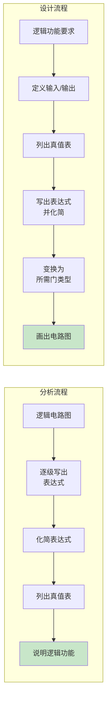
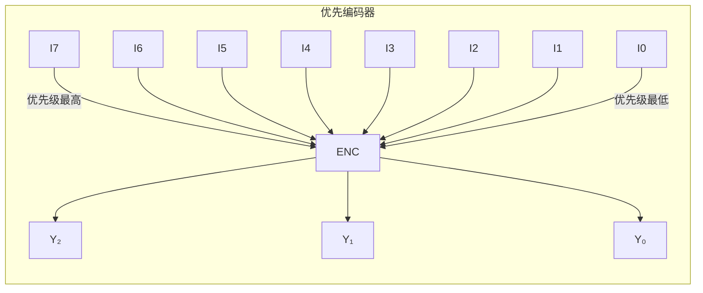
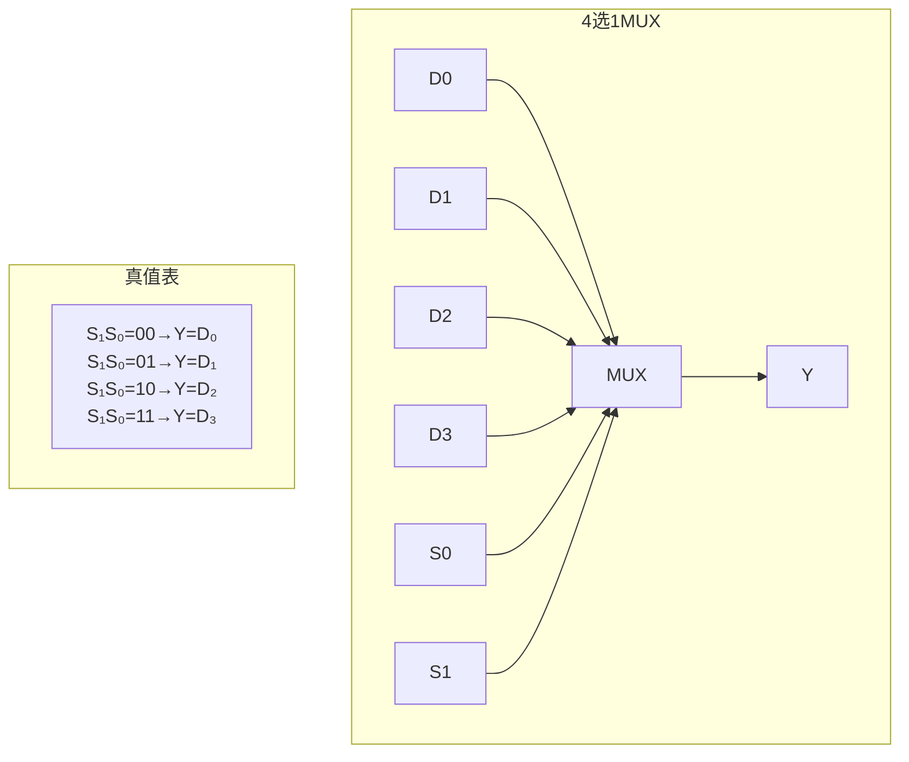
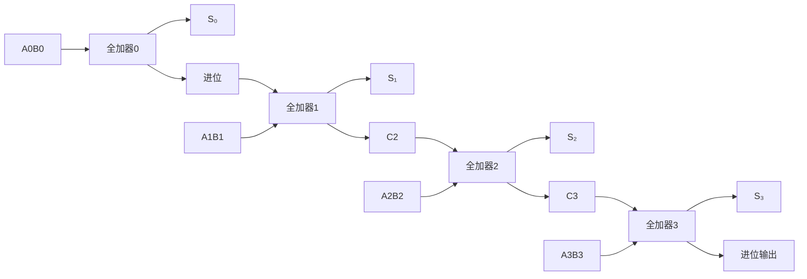
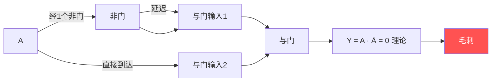

## 第四章：组合逻辑电路

### 4.1 组合逻辑电路的分析与设计

#### ① 核心概念

**一句话总结：**
> 组合逻辑电路的输出仅取决于当前输入（无记忆功能），分析是从电路图到逻辑功能，设计是从功能要求到电路图。

**组合逻辑 vs 时序逻辑：**

| 特性 | 组合逻辑 | 时序逻辑 |
|:----|:---------|:---------|
| 输出依赖 | 仅当前输入 | 当前输入 + 历史状态 |
| 存储元件 | 无 | 有（触发器） |
| 结构 | 只有门电路 | 门电路 + 触发器 |
| 举例 | 加法器、译码器 | 计数器、寄存器 |



#### ② 分析方法详解

**步骤：**
1. 从输入到输出，逐级写出各门输出的逻辑表达式
2. 化简表达式（代数化简或卡诺图化简）
3. 列出真值表
4. 说明电路的逻辑功能

**例题1**：分析下图所示的组合逻辑电路（逻辑表达式 → 真值表 → 功能）。

假设电路由三个门组成：
- G₁: \( Y_1 = \overline{AB} \)（与非门）
- G₂: \( Y_2 = \overline{BC} \)（与非门）
- G₃: \( F = \overline{Y_1 \cdot Y_2} = \overline{\overline{AB} \cdot \overline{BC}} \)

**解**：
\[
F = \overline{\overline{AB} \cdot \overline{BC}} = AB + BC \quad (\text{摩根定律})
\]

真值表：

| A | B | C | AB | BC | F |
|:-:|:-:|:-:|:--:|:--:|:-:|
| 0 | 0 | 0 | 0 | 0 | 0 |
| 0 | 0 | 1 | 0 | 0 | 0 |
| 0 | 1 | 0 | 0 | 0 | 0 |
| 0 | 1 | 1 | 0 | 1 | 1 |
| 1 | 0 | 0 | 0 | 0 | 0 |
| 1 | 0 | 1 | 0 | 0 | 0 |
| 1 | 1 | 0 | 1 | 0 | 1 |
| 1 | 1 | 1 | 1 | 1 | 1 |

**功能**：当B=1且(A=1或C=1)时输出1，即 \( B(A+C) \)。

#### ③ 设计方法详解

**步骤：**
1. 分析设计要求，确定输入/输出变量及逻辑赋值
2. 列出真值表
3. 由真值表写出逻辑表达式并化简
4. 根据选定门电路类型变换表达式
5. 画出逻辑电路图

**例题2**：设计一个三变量"奇偶校验电路"——输入中1的个数为奇数时输出1，否则输出0。

**解**：

步骤1：输入A、B、C，输出F。

步骤2：真值表

| A | B | C | 1的个数 | F |
|:-:|:-:|:-:|:-------:|:-:|
| 0 | 0 | 0 | 0 | 0 |
| 0 | 0 | 1 | 1 | 1 |
| 0 | 1 | 0 | 1 | 1 |
| 0 | 1 | 1 | 2 | 0 |
| 1 | 0 | 0 | 1 | 1 |
| 1 | 0 | 1 | 2 | 0 |
| 1 | 1 | 0 | 2 | 0 |
| 1 | 1 | 1 | 3 | 1 |

步骤3：写出表达式
\[
F = \sum m(1,2,4,7) = \overline{A}\,\overline{B}C + \overline{A}B\overline{C} + A\overline{B}\,\overline{C} + ABC
\]
卡诺图化简：
```
       BC
       00  01  11  10
   +----+---+---+---+
A 0 | 0 | 1 | 0 | 1 |
   +----+---+---+---+
  1 | 1 | 0 | 1 | 0 |
   +----+---+---+---+
```
没有可合并的相邻1（每个1都被"孤立"），最简式就是最小项之和：
\[
F = A \oplus B \oplus C
\]

步骤4：用异或门实现（最简单）或普通门实现。

步骤5：电路图 → 两个异或门级联：\( F = (A \oplus B) \oplus C \)

---

### 4.2 常用组合逻辑模块

#### ① 编码器（Encoder）

**一句话总结：**
> 编码器将输入的"有效信号"转换成对应的二进制代码——如8线-3线编码器将8个输入信号编码为3位二进制输出。

**8线-3线优先编码器 74LS148：**



**优先编码逻辑**：当多个输入同时有效时，只对优先级最高的输入编码。

**例题3**：74LS148输入信号 \( \overline{I_0} \sim \overline{I_7} \)（低有效），优先级从I₇最高到I₀最低。若 \( \overline{I_2}=0 \)，\( \overline{I_5}=0 \)，其他输入为1，输出 \( Y_2Y_1Y_0 \) 是什么？

**解**：
虽然I₂和I₅同时有效，但I₅的优先级高于I₂，所以对I₅编码。
输出 \( Y_2Y_1Y_0 = 101 \)（I₅的编码，低有效输入但输出一般为原码或反码取决于芯片规格，74LS148输出为反码）。
74LS148的输出是反码：I₅输入 → 输出 \( \overline{Y_2Y_1Y_0} = 101 \)（注意这里的反码是相对于111为0，000为7）。

实际上74LS148：输入I₇有效(I₇=0)输出000(反码，表示7)，I₆有效输出001(表示6)，...，I₅有效输出010(表示5的取反？)

查标准：
- I₇=0 → Y₂Y₁Y₀=000 → 对应7
- I₆=0 → Y₂Y₁Y₀=001 → 对应6  
- I₅=0 → Y₂Y₁Y₀=010 → 对应5

所以 I₅=0 → Y₂Y₁Y₀=010。

但等等，74LS148是低有效输入、低有效使能，输出也是低有效的编码。当 I₅=0时，Y₂Y₁Y₀ = 010（这对应的是反码输出，010表示十进制2，但对应输入是5）。实际上，74LS148用3位二进制反码表示输入编号。

更简单的理解方式：Y₂Y₁Y₀是输入编号的二进制**反码**。
I₅(编号5)的二进制 = 101，反码 = 010 ✓

#### ② 译码器（Decoder）

**一句话总结：**
> 译码器是编码器的逆过程——将n位二进制代码"翻译"为 \( 2^n \) 个输出信号，每个输出对应一个输入代码。

**3线-8线译码器 74LS138：**

| 输入 \( A_2A_1A_0 \) | 输出(低有效) |
|:---:|:---:|
| 000 | \( \overline{Y_0}=0 \)，其他=1 |
| 001 | \( \overline{Y_1}=0 \)，其他=1 |
| 010 | \( \overline{Y_2}=0 \)，其他=1 |
| ... | ... |
| 111 | \( \overline{Y_7}=0 \)，其他=1 |

**译码器的扩展：**

用两片 3线-8线译码器构成 4线-16线译码器：

```mermaid
flowchart LR
    A[A₃=0] -->|片选| E1[片1 使能]
    A -->|经非门| E2[片2 使能]
    A₂A₁A₀ --> D1[片1<br/>3-8译码器]
    A₂A₁A₀ --> D2[片2<br/>3-8译码器]
    D1 --> Y0_7[Y₀~Y₇]
    D2 --> Y8_15[Y₈~Y₁₅]
```

**译码器实现组合逻辑：**
译码器输出所有最小项，因此任何组合逻辑函数都可以用"译码器 + 或门"实现。

**例题4**：用3线-8线译码器实现 \( F(A,B,C) = \sum m(1,3,5,7) \)

**解**：
将A,B,C接到译码器的地址输入端（A=MSB）。译码器输出 \( \overline{Y_i} = \overline{m_i} \)（低有效）。
\[
F = m_1 + m_3 + m_5 + m_7 = \overline{\overline{m_1} \cdot \overline{m_3} \cdot \overline{m_5} \cdot \overline{m_7}} = \overline{Y_1 \cdot Y_3 \cdot Y_5 \cdot Y_7}
\]

电路：用3-8译码器（74LS138），将 \( \overline{Y_1}, \overline{Y_3}, \overline{Y_5}, \overline{Y_7} \) 连接到与非门的输入端。

#### ③ 数据选择器（MUX）

**一句话总结：**
> 数据选择器就像一个"多路开关"，在地址选择信号的控制下，从多路输入数据中选择一路送到输出。

**4选1数据选择器的逻辑表达式：**
\[
Y = \overline{S_1}\,\overline{S_0} \cdot D_0 + \overline{S_1}S_0 \cdot D_1 + S_1\overline{S_0} \cdot D_2 + S_1S_0 \cdot D_3
\]



**用MUX实现组合逻辑：**

**例题5**：用8选1数据选择器实现 \( F(A,B,C) = \sum m(0,2,3,5,7) \)

**解**：
将A,B,C接到MUX的地址选择端S₂,S₁,S₀。
数据输入端D₀~D₇对应最小项m₀~m₇。
在函数包含的最小项对应的数据端接1，其余接0：

| 地址(A,B,C) | 对应最小项 | F | 数据端 |
|:---------:|:---------:|:-:|:-----:|
| 000 | m₀ | 1 | D₀=1 |
| 001 | m₁ | 0 | D₁=0 |
| 010 | m₂ | 1 | D₂=1 |
| 011 | m₃ | 1 | D₃=1 |
| 100 | m₄ | 0 | D₄=0 |
| 101 | m₅ | 1 | D₅=1 |
| 110 | m₆ | 0 | D₆=0 |
| 111 | m₇ | 1 | D₇=1 |

#### ④ 加法器

**半加器（Half Adder）：**
- 输入：A（加数）、B（被加数）
- 输出：S（和）、C（进位）

| A | B | S | C |
|:-:|:-:|:-:|:-:|
| 0 | 0 | 0 | 0 |
| 0 | 1 | 1 | 0 |
| 1 | 0 | 1 | 0 |
| 1 | 1 | 0 | 1 |

\[
S = A \oplus B,\quad C = AB
\]

**全加器（Full Adder）：**
- 输入：A、B、Cᵢ（来自低位的进位）
- 输出：S（和）、Cₒ（进位）

| A | B | Cᵢ | S | Cₒ |
|:-:|:-:|:-:|:-:|:--:|
| 0 | 0 | 0 | 0 | 0 |
| 0 | 0 | 1 | 1 | 0 |
| 0 | 1 | 0 | 1 | 0 |
| 0 | 1 | 1 | 0 | 1 |
| 1 | 0 | 0 | 1 | 0 |
| 1 | 0 | 1 | 0 | 1 |
| 1 | 1 | 0 | 0 | 1 |
| 1 | 1 | 1 | 1 | 1 |

**表达式：**
\[
S = A \oplus B \oplus C_i
\]
\[
C_o = AB + AC_i + BC_i = AB + C_i(A \oplus B)
\]

**4位二进制加法器（串行进位）：**



---

### 4.3 竞争-冒险

#### ① 核心概念

**一句话总结：**
> 由于门电路的传输延迟，信号走不同路径到达同一门的时间不同，可能导致输出出现不应有的"毛刺"脉冲——这称为竞争-冒险。



**正常情况下：** \( Y = A \cdot \overline{A} = 0 \)（恒为0）
**实际情况下：** A变化时，\(\overline{A}\)因非门延迟而晚到，短时间内 \( A = 1, \overline{A} \) 还未变 → A·Ā = 1（产生毛刺）！

#### ② 判断方法

**代数法：** 检查函数能否化为 \( X + \overline{X} \)（1型冒险）或 \( X \cdot \overline{X} \)（0型冒险）的形式。

**例题6**：判断 \( F(A,B,C) = AB + \overline{A}C \) 是否存在竞争-冒险。

**解**：
当 \( B=C=1 \) 时，\( F = A + \overline{A} = 1 \)（恒为1）。
若A变化时\(\overline{A}\)延迟到达，可能出现0毛刺（1型冒险）。

**卡诺图法：** 检查卡诺图中是否存在"相切"（相邻但不相交）的圈。

卡诺图：
```
       BC
       00  01  11  10
   +----+---+---+---+
A 0 | 0 | 1 | 1 | 0 |
   +----+---+---+---+
  1 | 0 | 0 | 1 | 1 |
   +----+---+---+---+
```
圈1：\( \overline{A}C \)（m₁和m₃）
圈2：\( AB \)（m₆和m₇）
两个圈在m₅(101)处相切——B=1,C=1,A从0→1或1→0时产生冒险。

#### ③ 消除方法

**方法1——添加冗余项：**
在相切处添加冗余项（图中是m₅和m₇所在的BC圈），使过渡时输出被冗余项"保持"。

\[
F = AB + \overline{A}C + BC
\]

添加 \( BC \) 后，当 B=C=1 时，无论A如何变化，BC=1保持输出。

**方法2——输出加滤波电容：**
在输出端对地接小电容（几十pF），滤除窄毛刺。

**方法3——引入选通脉冲：**
在电路稳定后再读取输出，避开毛刺时段。

---

### 4.4 练习题

**基础题：**

1. 用与非门实现 \( F = A + BC \)
2. 用3线-8线译码器实现 \( F(A,B,C) = \sum m(0,3,6,7) \)
3. 用8选1MUX实现 \( F(A,B,C) = \sum m(1,2,4,7) \)

**进阶题：**

4. 设计一个1位全加器，要求用最少门电路实现。
5. 设计一个4位BCD码奇偶校验电路（输入4位BCD码，若含奇数个1则输出1）。
6. 分析 \( F(A,B,C) = (A+B)(\overline{A}+C) \) 是否存在竞争-冒险，若存在如何消除？

**解答提示：**
> 题1：\( F = \overline{\overline{A} \cdot \overline{BC}} \)
> 题4：全加器S = A⊕B⊕Cᵢ，Cₒ = AB + Cᵢ(A⊕B)
> 题6：当B=0,C=0时函数为 \( A \cdot \overline{A} \)，存在0型冒险，添加冗余项 \( \overline{B}\,\overline{C} \)
